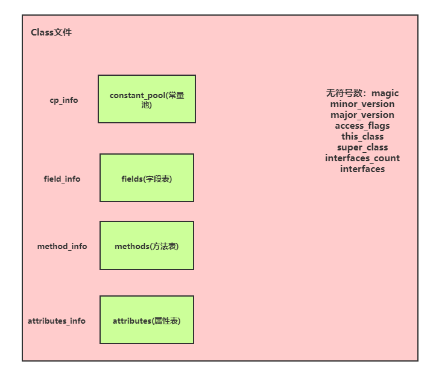

## 类文件结构

> Write Once, Run Anywhere

Java程序的运行是与平台无关的，这一切得益于Java虚拟机的实现，而Java虚拟机也不只可以运行Java程序。而这一切的基础都是基于所有平台统一使用的程序存储格式---字节码。

虚拟机规范规定了Java虚拟机不合任何语言绑定，只和字节码"Class文件"这种二进制文件格式关联。

程序将被各自的编译器编译成字节码，而Java虚拟机可以在仍和平台上执行字节码。

### Class文件的结构

这里的Class文件方便理解可以狭义的考虑成.java编译后的.class文件，因为实际的字节码来源可能是多样的。

Class文件的定义：

> Class文件是一组以8位字节位基础单位的二进制流，数据全部紧凑排列在文件中。而数据结构仅有两种：无符号数和表

- 无符号数可以用来表示**数字**，**索引引用**，**数量值**，**字符串值（按UTF-8）**
- 表对应文件结构中的复杂类型，可以由无符号数或其他表构成，习惯以-info结尾

可以看出Class文件就是一个大的表结构，一个Class文件中的数据项如下图：

包含如下信息：

#### 无符号数

1. `magic`：用于给虚拟机进行身份校验的魔数，判断是否可以被虚拟机接收。**占4个字节**，Java程序的字节码为0xCAFEBABE，4bytes = 32bits，为32个二进制位如果按16进制解码（4个二进制位）正好8个16进制数

2. `minor_version&major_version`：分别各占**2个字节**，minor表示次版本号，major为主版本，如45.222，45为主，222为次

3. `access_flags`：**2个字节**，访问标识共16个二进制位标识如是接口还是类，是否final等信息。（实际仅使用了8个二进制位）

4. `this_class&super_class&interfalces`：各占**2个字节**，分别为类索引，父类索引以及接口索引。类索引和父类索引均用于确定全限定名（**如java.lang.Object**），接口索引描述此类实现了哪些接口，如果没有实现任何接口那么`interfaces_count`值为0，而接口的索引表将不占用任何字节。

   这里索引的查找过程均是通过指向的`CONSTANT_Class_info`表，再查到`CONSTANT_Utf8_info`表中的具体值（这两个表均是常量池中的表）

#### 表

>  **注意不要混淆。这里的表均指数据结构，不是集合的概念。而在储存介质上，这块区间是连续排列的。**

##### 常量池表

常量池是Class文件结构中与其他项目关联最多的数据类型。其中主要存放，字面量（字符串，final的常量值）和符号引用(全限定名，字段的名称和描述符，方法的名称和描述符)。

常量池中共有14种表（14种结构，不是只有14个表）：

CONSTANT_Utf8_info,  CONSTANT_Integer_info, CONSTANT_Float_info, CONSTANT_Long_info, CONSTANT_Double_info, CONSTANT_Class_info, CONSTANT_String_info, CONSTANT_Fieldref_info, CONSTANT_Methodref_info, CONSTANT_InterfaceMethodref_info, CONSTANT_NameAndType_info, CONSTANT_MethodHandle_info, CONSTANT_MethodType_info, CONSTANT_InvokeDynamic_info

特点是每个表开头都有一个字节标明当前表的类型。

- `CONSTANT_Class_info`的结构实际上只有一个tag（表明表类型）以及name_index，索引将指向`CONSTANT_Utf8_info`表；
- `CONSTANT_Utf8_info`表由tag, length, bytes组成，一个常量的长度和具体的字节信息。Class文件中的方法，字段等都需要引用这个类型来描述名称。而length仅有2个字节，表示长度为0~65535，而一个英文字符在UTF-8中占一个字节，所以最长的方法名不可以超过(2^16bytes)64KB，否则会无法编译。

##### 关于常量池表是如何被解读的

因为提到了这里的表都是数据结构，而不是集合概念，那么像`CONSTANT_Class_info`这种索引是如何解读的？

那么以下图为例：

| offset | 0    | 1    | 2    | 3    | 4    | 5    | 6    | 7    | 8    | 9    | A    | B    | C    | D    | E    | F    |
| ------ | ---- | ---- | ---- | ---- | ---- | ---- | ---- | ---- | ---- | ---- | ---- | ---- | ---- | ---- | ---- | ---- |
|        | CA   | FE   | BA   | BE   | 00   | 00   | 00   | 32   | 00   | 16   | `07` | 00   | 02   | `01` | 00   | 1D   |
|        | 6F   | 72   | 67   | 2F   | 66   | 65   | 6E   | 69   | 78   | 73   | 6F   | 66   | 74   | 2F   | 63   | 6C   |
|        | 61   | 7A   | 7A   | 2F   | 54   | 65   | 73   | 74   | 43   | 6C   | 61   | 73   | `7`3 | 07   | 00   | 04   |

07表示该类型是`CONSTANT_Class_info类型`而后面的连续两个字节为00 02，表示它指向常量池中的第二个表，而它是第一个表，所以接下来的字节就是第二个表。tag信息为01，表示是`CONSTANT_Utf8_info`是一个常量，接下来两个字节为00 1D表示长度29个字节都是这个表的数据，解读后为org/fenisoft/clazz/TestClass。可以看到因为紧密排布的原因，表进行顺序的查找就可以使用索引了。

##### 字段表（field_info）

field其实表明了，字段表描述的是类级变量以及实例级变量。字段表存在如下信息：

1. 字段访问标志`access_flag`：访问范围（public, private, protected），是否是类变量（static），是否可变（final），内存可见（voltaile），是否可序列化（transient），是否枚举（enum），是否编译器生成（ACC_SYNTHETIC）。一共两个字节存储这些标志位

2. `name_index&descriptor_index`：简单名称索引及描述符索引，均指向常量池，描述符的将描述字段的数据类型，方法的参数列表，以及返回值（都是描述各个地方的变量）。

   | 标识字符 | 含义     |
   | -------- | -------- |
   | B        | byte     |
   | C        | char     |
   | D        | double   |
   | F        | float    |
   | I        | int      |
   | J        | long     |
   | S        | short    |
   | Z        | boolean  |
   | V        | void     |
   | L        | 对象类型 |

   数组使用`[`表示，如一个String[] [] 的二维数组将被描述符标识为`[[Ljava/lang/String`。

3. `attributes_count&attributes`：对象的属性表，在属性表里会具体展开

##### 方法表

与上述字段表一样，由5块构成。其中`descriptor_index`描述方法的返回值，如int test(String str, int[] i)会被描述为(Ljava/lang/String[I)I，而方法的代码则存在与属性表中。

##### 属性表（attributes_info）

> Class文件，字段表，方法表都可以携带自己的属性表集合，用于描述某些场景专有的信息

上述字段表中除了名称外的详细信息以及方法表中的代码都在属性表中体现。

属性表的结构如包含`attribute_name_index`(2bytes)，`attribute_length`(4bytes)，`info`(变长)。而实际上虚机规范预设了21种(1.7)属性，用户自己实现的属性也是被允许的。各种属性均会通过`attribute_name_index`在常量池中标识当前属性的具体类型，`info`中是按不同属性的结构区分。**这里也是属性表和其他表不太相同的地方，属性表的定义是广泛的，具体的属性又在内部会有不同的结构**。

1. Code属性：这里是编译之后的代码，包括长度最大2字节的代码以及异常信息等。这是Class文件中最重要的属性，仅有这块是真正描述代码的。其他的内容都可以理解成对元数据的描述
2. Exceptions属性：列举方法中可能抛出的受检异常
3. LineNumberTable属性：描述Java源码行号与字节码行号，将影响debug以及报错时的行号信息
4. LocalVariableTable属性：描述栈帧中局部变量表与Java源码中变量的关系
5. SourceFile属性：记录生成Class文件的源码文件名称
6. ConstantValue属性：通知虚拟机为静态变量赋值，这里仅指static,final共同修饰的变量
7. InnerClasses属性：内部类信息
8. Deprecated和Synthetic属性
9. StackMapTable属性：用于类加载时的代码验证，替换原来代码验证阶段的逻辑推导，性能更好
10. Signature属性：用于支持泛型（这里需要开一个坑）
11. BootstrapMethods属性

### 总结

- Class文件的数据结构仅有两种，无符号数和表
- 无符号数可以用来标识数量值，字符串，索引以及数字
- 表是真正复杂的数据结构，主要的表结构有：
  - 常量池表：记录各种常量以及名称信息
  - 字段表：类或实例的变量，不包括方法中的局部变量，使用了属性表
  - 方法表：方法的描述符以及其属性，使用了属性表
- 属性表规定了通用结构，具体的属性会有所区别，Code属性中保存了编译的代码
- 各种名称以及常量信息会通过索引的方式指向常量池

