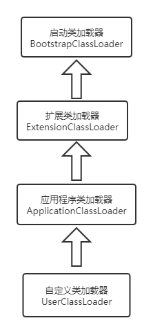

## 虚拟机类加载机制

### 类加载器是干什么的？

> “通过一个类的全限定名来获取描述此类的二进制字节流”，类加载器是完全独立于虚拟机的实现。

上文讲到字节码是虚拟机通用的运行格式，那么类加载器就是将Class文件加载进Java虚拟机的工具（Class文件显然不能自己进入虚拟机，而虚拟机显然也不能在一无所知的情况下知道该加载什么Class文件）。所以类加载器是编译字节码后，虚拟机真正运行前以及运行时的加载工具。

宏观上来说，类加载器只有两种：**启动类加载器**，**其他类加载器**；这两种其实对应了上述的运行前以及运行时的类加载，**启动类加载器**是由C++进行实现（不可以直接在Java中使用），**其他类加载器**均是Java实现独立与虚拟机之外

- 启动类加载器（Bootstrap ClassLoader）: 负责将存放在`<JAVA_HOME>\lib` 目录中的，或者被-Xbootclasspath参数所指定的路径中且被虚拟机识别的类加载到虚拟机内存中。**所以启动类加载加载了程序运行的类库到虚拟机中，提供运行的基础。**
- 扩展类加载器（Extension ClassLoader）:  由`sun.misc.Launcher$ExtClassLoader`实现，负责加载`<JAVA_HOME>\lib\ext` 目录中的，或者被java.ext.dirs系统变量所指定路径中的所有类库。
- 应用类加载器（Application ClassLoader）: 由`sun.misc.Launcher$AppClassLoader`实现，同时是ClassLoader.getSystemClassLoader()的返回值所以也叫系统类加载器，负责加载用户类路径上的类库，如果没有自定义的类加载器，这个将是程序中使用的默认类加载器。Java工程下的\bin目录中的Class文件由这个加载器加载

### 双亲委派机制

先看下面双亲委派的模型实现：

```java
public abstract class ClassLoader {

    protected Class<?> loadClass(String name, boolean resolve) throws ClassNotFoundException {
        synchronized (lock) {
            // 尝试从缓存获取，这也是为什么修改了Class后需重启JVM才能生效
            Class<?> target = findLoadedClass(name); // native方法
            if (target == null) {
                try {
                    if (parent != null) {
                        // 委托给父加载器， 只查找不解析
                        target = parent.loadClass(name, false);
                    } else {
                        // 父加载器为null，则委托给启动类加载器BootstrapClassloader
                        target = findBootstrapClassOrNull(name); // native方法
                    }
                } catch (ClassNotFoundException e) {
                    //父类加载器抛出ClassNotFoundException说明父类无法进行加载
                }
				
				
                if (target == null) {
                    // 父加载器没有找到，才调用自己的findClass()方法
                    target = findClass(name);
                }
            }
            if (resolve) {
                resolveClass(target); // native方法
            }
            return target;
        }
    }
    
    // findClass是模板方法，需要重写
    protected Class<?> findClass(String name) throws ClassNotFoundException {
        throw new ClassNotFoundException(name);
    }    
}
```

这个模型的工作过程是：如果一个类加载收到了类加载请求，会优先使用父加载器进行加载，失败了才使用当前的类加载器：



可以看到双亲委派只是简单的单链的层级关系，其实只存在**“父类”**，并没有**“双亲”**。

#### 双亲委派的意义

> 确保全局的唯一性

这种机制确保了，所有包中的Class文件和其类加载器一起形成了带有优先级的层次关系。Class文件位于包中，而包是树状的层级结构，每个包必然可以得到支持该包中类加载的最顶层的类加载器，也就是所有的类必然可以通过这种向上查找类加载器的方式和唯一的类加载器对应起来。

需要这种机制的保证是因为在虚拟机中唯一确定类的方式，不只关注类本身。**类和其类加载器确定其在虚拟机中的唯一性**。同一个类被不同的加载器加载会被识别成不同的类（instanceof）。

### 类加载

先扯上面东西的目的是我觉得明白类加载器是何时作用以及为何类加载器是Java语言的重要创新是比类加载的过程更有意义的事。

#### 类加载的时机

虚拟机规范规定了5种必须加载的情况：

1. new, getstatic, putstatic, invokestatic这4条字节码指令时。场景：new了一个新的对象（之前没有使用过），读取static变量，调用静态方法。
2. 进行反射调用时。
3. 初始化一个类时，其父类没有加载，需要对父类进行加载。
4. 虚拟机启动时，对运行主类的加载（main()方法所在的类）。
5. 动态语言支持时，句柄对应的类没有加载（这个不是很懂）。

且以上5种情况称为对类的**主动引用**，与之对应的**被动引用**不会触发类的加载动作。

**被动引用**：

1. 子类继承父类的静态变量，通过子类使用该变量，不会加载子类。（子类这里相当于提供了入口，但实际使用的是父类的变量）
2. 创建一个类的数组，不会加载该类。这里其实涉及到一点数组在虚拟机中的实现，所有的数组首先都是对象，且都是有虚拟机自动生成的，继承自java.lang.Object类，所以这里虽然是引用了这个类，但具体使用的是自动生成的Object子类，不会加载该类。
3. 使用常量不会加载该类（指static, final修饰的变量），这条需要区分第一条，因为static修饰的变量属于类变量，类变量将在类初始化方法中进行赋值<clinit>()，而常量将在编译期就被**常量传播优化**统一存储到了`NonInitialization`类中，也就是编译后的常量和原本的类其实已经没有联系了。

#### 类加载的过程

##### 加载（Class文件进入方法区）

在加载阶段，虚拟机主要完成以下三件事：

1. 通过一个类的全限定名来获取定义此类的二进制字节流
2. 将这个字节流所代表的静态存储结构转化为方法区运行时数据结构
3. 在内存中生成一个代表这个类的java.lang.Class对象，作为**方法区**这个类数据的访问入口

这个阶段中“通过全限定名获取二进制字节流”是开发人员可控性最强的地方，也是各种类加载器自定义实现的依赖所在。二进制字节流可以根据需求从，ZIP包，网络，运行时生成等各种地方获取。

而这个阶段完成后，**虚拟机外部的二进制字节流（一般是Class文件）就变成了所需的格式存储在方法区之中**。

##### 验证(确保字节流可信)

加载后的Class文件仍然是字节流的形式存在方法区中，会依次进行如下验证：

1. 文件格式验证：魔数，主次版本号，常量池的tag标识，指向常量的索引值是否有不存在的，CONSTANT_Utf8_info是否有不符合编码的数据等等。
2. 元数据验证：类是否有父类（除了Object都应该有父类），是否继承了不被允许继承的类，是否实现了接口和抽象方法，重载是否合法等等
3. **字节码验证**：整个验证过程中最复杂的阶段，**通过数据流和控制流分析确定程序语义是否合法**。1.6之后考虑到这部分验证功能的性能，**Code属性**增加了**StackMapTable属性**从而将类型推导替换成类型检查。但验证不能保证安全，因为“没错”本身就不一定是安全的。
4. 符号引用验证：对自身以外的信息进行匹配性校验。

##### 准备（分配内存及默认值）

为类变量分配内存并设置类变量初始值的阶段，类变量在此阶段的值将是默认值而不是用户定义值。

在这个阶段**Code属性**中的**ConstantValue属性**将发挥作用，虚拟机将根据**ConstantValue**的设置对常量进行赋值。

**但是这里其实是有一点点疑问的**，如果常量是在类加载的准备阶段赋值，那为何使用常量不需要加载定义常量的类？前面提到的编译器常量传播优化指的应该是，编译器会收集类中定义的常量然后生成到一个`NonInitialization`的类中，那么这样读取常量是还是需要加载类，只不过加载的是编译期生成好的其他类而非定义的类。

##### 解析（与其他类间的关联）

这个阶段将常量池内的符号引用替换为直接引用，

- 符号引用：以一组符号来描述所引用的目标，符号可以是任何形式的字面量，只要可以无歧义的定位到目标。
- 直接引用：可以是直接指向目标的指针、相对偏移量或是一个能间接定位到目标的句柄，和内存相关。

主要解析如下内容：

1. 类和接口
2. 字段
3. 类方法
4. 接口方法

##### 初始化（最后一步）

前面的全部阶段中，除了用户可以自定义类加载器参与其中外，全部由虚拟机控制，这个阶段是真正开始执行用户代码的阶段。也可以将这个阶段称为调用`<clinit>()`方法的过程。

关于`<clinit>()`：

- 这里面的方法是由编译器自动收集类中的所有类变量的赋值动作以及静态语句（static{}修饰）合并产生的，静态语句块不能访问定义在其之后的变量，只能赋值（这里代码顺序是严格的）。

- `<clinit>()`执行前会确保父类的该方法已经执行，所有父类的构造方法一定先于子类。

- 且这个方法是阻塞的，不同的线程尝试加载类时会阻塞等待，存在隐式阻塞的可能
- 区分类的实例化方法`<init>()`，该方法是从类构建实例，clinit是构建类。