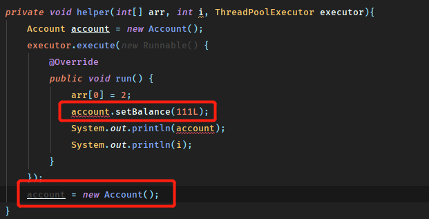

# final关键字

## 关键字的使用

`final`可以用来修饰类、方法和变量。

- 修饰类，表明这个类不能被继承，同时类中的所有成员方法会被隐式的指定为final方法

- 修饰方法，

  > “使用final方法的原因有两个。第一个原因是把方法锁定，以防任何继承类修改它的含义；第二个原因是效率。在早期的Java实现版本中，会将final方法转为内嵌调用。但是如果方法过于庞大，可能看不到内嵌调用带来的任何性能提升。在最近的Java版本中，不需要使用final方法进行这些优化了。”
  >
  > ---《Java编程思想》

- 修饰变量，区分是基本类型还是引用类型（对象），如果是基本类型则初始化后值不可以改变，如果是引用类型则引用不可变（对象内容可变）


**接下来从几个比较常见的问题来分析`final`关键字的应用**

## String为什么是final修饰的？

我们很容易从各种地方了解到下面三种结论。

1. 为了实现字符串常量池
2. 为了线程安全
3. 为了创建String可以实现HashCode不可变性

但是上面的三点其实相互之间有所包含，又或者没有实际回答**String为什么是`final`修饰**这个问题。

为了解释上面三点以及回答这个问题，我们需要先了解设计String类时工程师们的考虑。对于String以及其他基本类型的封装类型，都有考虑使用常量池的设计，目的是为了减少不必要的内存使用，常量本身都是字面量，不需要多个不同的对象来表示，而是相同字面值的不同对象指向同样的内存。

### String需要实现不可变性

那么在实现常量池的需求之下，就提出了String不可变性的需要。因为String对象使用字面量赋值时，会使用常量池，而**常量池的工作方式是按其字面量进行HashCode的运算，如果有对应的Key则返回保存的引用，否则在堆中创建一个对象，返回其引用并在这个Map中保存**。

所以我们可以看到，不可变性是处于Hash运算的考虑，（如果Hash的对象可变，则会导致Key存储之后会变化，Hash实际上就失效了），而Hash运算又是实现**字符串常量池**的需要。

至于线程安全，也是上述不可变性带来的结果之一，任何对字符串的增删都会创建一个新的对象或指向其他的引用，而不会修改原来的对象值，这样也就确保了线程之间操作字符串不会相互影响，也不至于为了字符串的操作而做同步。

### final和不可变性

所以在理清了上面的思路后，会神奇的发现，与其说String需要`final`不如说String需要的是**不可变性**

回到String类中来，

```java
public final class String
    implements java.io.Serializable, Comparable<String>, CharSequence {
    /** The value is used for character storage. */
    private final char value[];
```

可以看到`final`修饰了两个地方，类和char[]，修饰类则不可被继承，String不存在子类暴露内部char[]的可能性。而char[]的修饰，`private`的作用可能比`final`更大，因为修饰了`private`后，String没有提供任何暴露char[]引用的方法，其实char[]已经不可能被接触到，如果接触到了，`final`也不能阻止其被修改，所以这里是`private`和`final`共同保证了不可变性。

所以最后说回来，没有`final`关键字，则String的线程安全，以及常量池的实现都不可能保证。


## 匿名内部类的参数为什么必须是final？

这个问题严格描述应该是**匿名内部类不能访问外部类方法中的局部变量，除非被final修饰**。

关于这个问题很容易找到诸如，**“局部变量的生命周期可能和匿名内部类的生命周期不同，导致匿名内部类引用了不存在的变量”**这样的回答。其实这样的回答有一点道理也提及了解答这个问题必须的一些知识，但其实这样的描述是模糊不清的。

### 与生命周期无关

因为我们知道，对象的生命周期和它是否作为局部变量没有关系，而基本类型的局部变量则确实会随着栈帧的出栈（方法调用结束）的消失。这里需要搞清楚的是，一个对象分配堆中内存后，栈帧中存在的是内存地址的值，而基本类型则是具体值的一份复制，所以说这个问题和生命周期其实没有多大关系，在方法中以局部变量new一个对象出来，在匿名内部类中是完全可以正常使用的。


（可以看到方法内定义一个对象，传递到匿名内部类中操作是没有任何问题的）

这里还需要提及另外一点，也就是匿名内部类的创建实际是对象的创建，传递到内部类中的参数，将会以构造器的方式把对象的地址值或基本变量的值传递（复制）给内部类对象，这点上表现得和普通对象的参数传递没有区别。

那么什么时候会需要使用`final`关键字呢？

我们仍然使用上面的例子：




可以看到当对象在内部或者外部被重新赋值时（变量指向新的对象时），提示错误了。这种时候就需要在外部堆定义的变量做`final`修饰。所以到这步，可能应该可以理解要求`final`的原因了，是出于对**数据一致性**的要求，因为逻辑上内部类和外部类的对象我们会默认认为始终是一个对象在进行处理，而不使用`final`进行修饰，则会在无意识中将对象重新赋值而导致内外的对象不再指向同一个对象，继续操作则会出现数据的不一致性。

因为匿名类的参数传递实际上是值的传递，而并非如同直观看到代码上那样是直接操作的一个对象，非常具有欺骗性，而`final`禁止引用重新赋值的功能就确保了，**内外的两个对象指向的是同一块内存**。

关于基本类型的修改也可以同样理解，所以实际的操作上，对于匿名内部类的参数传递都应当使用`final`修饰。

## final参数的初始化过程

-- To be continue