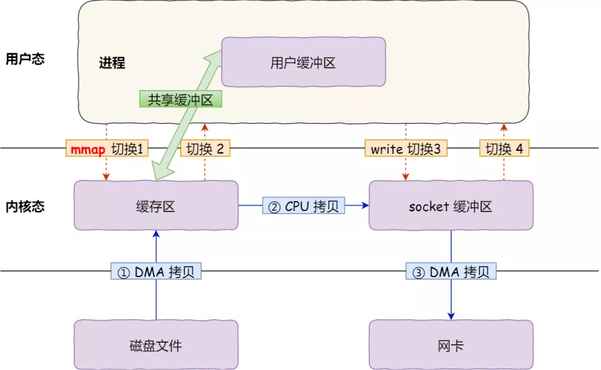

# 再探NIO之零拷贝

[总结来源文章小林coding，作者小林coding](https://mp.weixin.qq.com/s/FgBCop2zFfcX5ZszE0NoCQ)

[总结来源文章小林coding，作者小林coding](https://mp.weixin.qq.com/s/FgBCop2zFfcX5ZszE0NoCQ)

[总结来源文章小林coding，作者小林coding](https://mp.weixin.qq.com/s/FgBCop2zFfcX5ZszE0NoCQ)

这份总结将梳理之前不太清晰的零拷贝内容，将涉及如下知识点：**零拷贝，直接I/O，异步I/O，DMA，PageCache**

### 零拷贝指的到底是哪里的拷贝

其实这个**拷贝**牵扯到文件的I/O方式，传统的IO方式过程如下：

- CPU发出对应的指令给磁盘控制器，然后返回（CPU发出指令）
- 磁盘控制器接受到指令后开始准备数据，会把数据放入磁盘控制器内部缓存区中，然后产生一个**中断**；（磁盘准备数据）
- CPU响应中断，将缓冲区中数据一次一字节的读入寄存器，再将其写入内存，期间CPU无法执行其他任务（CPU搬运数据）

这个过程的时序图如下：

### 如果使用DMA（Direct Access Memory）技术

DMA技术，用户的IO请求最终会通过CPU传递到DMA，而DMA负责等待磁盘准备数据，准备完成后向DMA发送中断，而DMA将数据拷贝到内核缓冲区，再由CPU将数据从内核拷贝到用户缓存区。

整个过程CPU**不再参与磁盘到内核的数据搬运工作**。

### 传统的文件传输

这里指的是不使用DMA技术的IO方式，**如果进行一次服务器响应并将文件通过网络发送给客户端**，将使用两个系统调用

> read(file, tmp_buf, len);
> write(socket, tmp_buf, len);

(下面全是在服务器发送文件的基础上讨论)

可以看到发生了**两次状态切换，以及四次上下文切换，两次CPU拷贝**。

虽然在DMA技术的保障下，内核态到设备的数据拷贝由数据自己的DMA实现，但**内核缓存到用户缓存**的数据仍然是CPU负责搬运的。所有上述场景中，**CPU参与了两次拷贝工作**。

而且这里的服务器本质只是响应请求发送文件，**将文件拷贝到用户空间纯粹是多余的**，因为**用户程序并不对文件进行任何修改**

### 零拷贝技术

这里就可以引出**零拷贝的真正内涵**，指的是在整个文件发送过程中**CPU不参与任何的数据搬运工作**。

实现方式用两种，都需要**系统调用的以来**

- mmap+write
- sendfile

#### mmap+write(仍有一次CPU拷贝)

系统调用如下：

> buf = mmap(file, len);
> write(sockfd, buf, len);

流程如下：

mmap将用户缓存区和内核缓冲区进行映射，这样就省去了将内核数据拷贝到用户数据的过程。用户需要操作时执行操作内存映射。

但因为内核映射的仍然是用户内存，所有发送数据前需要将内核区的数据移动到socket缓冲区。

总体来看，仍然是**两次状态切换，四次上下文切换，一次CPU拷贝**

#### sendfile

在Linux内核2.1中，支持了一个专门用于发送文件的系统调用函数，sendfile()。

> \#include <sys/socket.h>
> ssize_t sendfile(int out_fd, int in_fd, off_t *offset, size_t count);

主要是将两个系统调用合并成了一个，过程类似上面的mmap+write的方式。**进行了一次状态切换，两次上下文，和一次CPU拷贝**

#### SG-DMA

真正的零拷贝

看图说话即可

只进行了必要的一次系统调用，同时复制过程不再在内核中重复进行，而是直接让数据的需求设备通过DMA直接拷贝走，**实现了整个过程，CPU的零拷贝**

### 搭配的小文件读取功能-PageCache

首先，PageCache只适合小文件读取，这将进一步加速零拷贝的读取速度。

当然加速的不是特定某次的读取速率，而是整体上的IO响应速度。

因为程序允许具有**局部性**，所以数据需求可能是**连续的，局部的**。

PageCache主要做到两点

1. 缓存最近的数据（假设以32kb为单位）
2. 预读功能

预读功能这么理解，磁盘的旋转是很消耗性能的，读取32kb和64kb可能区别不大，所以如果需求的是某32kb数据，内核会**顺便将后面连续的32kb也读入内存**，这件事对性能是没有消耗的。如果一旦程序需求了后面的数据，则会带来巨大收益。

总体上来说，磁盘的访问次数减少了，访问效率提升了。

#### 但不适合大文件

但是PageCache功能不适合大文件读取，因为

1. 大文件将长时间占用PageCache，而且大文件的特点是单次访问时间长，访问频率低，本身就不适合缓存。使用PC完全会多余一次拷贝的过程。
2. PageCache被大文件占据，而导致高频的**热点**文件，无法有效使用PageCache，本来可以频繁命中，而现在只能每次重新读取

大文件应该使用异步IO+直接IO的方式，绕开PageCache。

## 总结

- 传统IO：2次状态切换，4次上下文，4次CPU拷贝
- DMA：相比减少设备到内核的CPU拷贝，减少2次
- MMAP-Write: 不再拷贝到用户态，减少一次CPU拷贝
- Sendfile： 不再需要两次系统调用，减少一次系统调用，还剩一次CPU拷贝
- SG-DMA支持的sendfile：CPU不再在内核态中搬运数据，全部由设备DMA在内核态中进行拷贝，实现CPU零拷贝