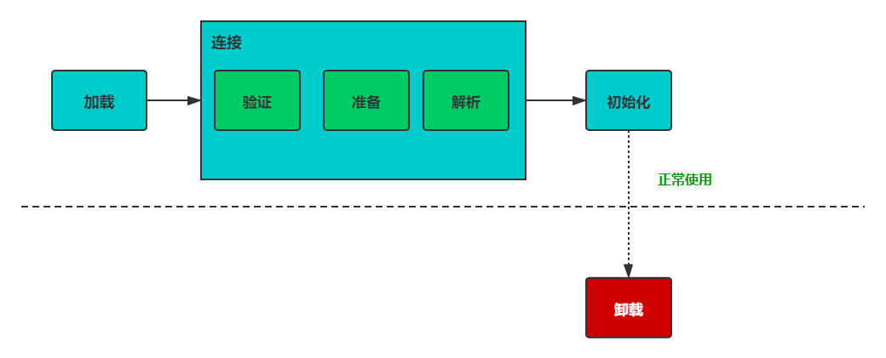
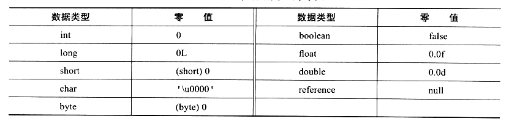

# 类的生命周期

一个类完整的生命周期如下图：



## 类加载过程

思考一次程序的执行过程，首先肯定是JVM已经启动并且在内存中，而代码还在硬盘中。所以必然经历从硬盘加载到内存并且完成准备后，程序才如我们所想那样开始工作。而类的加载就是准备的第一步。

Class文件只有加载到JVM中后才可以运行，而这个过程主要如上图分文三步

1. 加载
2. 连接
3. 初始化

### 加载

主要完成以下3件事：

1. 从物理存储中获取定义类的二进制字节流，但并表示只有初始的`.class`文件可以作为来源，运行时生成的字节码也是来源
2. 将字节流所代表的静态存储结构转换成方法区的运行时数据，这一步已经开始靠拢最终可以使用时的状态
3. 在内存中生成一个表示该类入口的Class对象，作为访问这些类的方法区入口。

**一个非数组类的加载阶段（加载阶段获取类的二进制字节流的动作）是可控性最强的阶段，这一步我们可以去完成还可以自定义类加载器去控制字节流的获取方式（重写一个类加载器的 `loadClass()` 方法）。数组类型不通过类加载器创建，它由 Java 虚拟机直接创建。**

而关于二进制字节流的来源并不局限于程序启动时已经编译好的`.class`文件，如下来源均可以提供**二进制流**

- 最常见的，从压缩包获取，比如jar，EAR，WAR等

- 从网络中获取，比如早期嵌入在浏览器中的Applet程序

- 在运行是生成字节码，动态代理技术。如著名的`GCLib`字节码类库，再如现在`Android`中常用的网络请求库`retrofit`中所使用的动态代理`Proxy.newProxyInstance()`中，最终会调用的`sun.misc.ProxyGenerator.generateProxyClass()`方法，该方法在运行时动态产生了一组字节码流（标识为`$Proxy`的代理类）。

- 由其他文件生成，比如由JSP文件生成class类

### 连接

#### 验证

验证的重要性在于保护JVM自身的需求，如上面的**字节码流来源**一样，**JVM**可以运行的`.class`文件并不完全都是由编译器编译而来（这部分`.class`文件是经过了严格检查的），而来源于动态直接生成的`.class`文件，并不会有**由`.java`编译成`.class`文件这个过程**，所以从这点上出发对`.class`文件的检查去保护虚拟机是必要的。

验证过程将按如下4步层层深入：

##### 文件格式的验证

> 针对类文件的验证

读取到了数据，首先需要确认字节码流是否符合JVM规范

- 魔数验证
- 比较验证JVM和文件各自声明的版本号
- 常量值类型的检查
- 指向常量的索引是否指向了不存在的常量
- Class文件的完整性

##### 元数据验证

> 针对数据类型的验证

进行Java语义分析，以确保其符合语言规范：

- 检查类是否有父类，Object可以除外
- 继承父类是否合法
- 是否实现了全部抽象类方法
- etc...

##### 字节码验证

> 针对方法体的验证

通过**数据流**和**控制流**分析，检查方法中语义的合法性，检查内容如下：

- （单个方法）确保任何时候**操作数栈**中的**数据**和**指令代码**可以正常工作
- 保证**跳转指令**不会跳转到方法体之外
- 类型转换的有效性
- etc..

##### 符号引用的验证

> 针对常量池匹配的验证

为了确保后续解析阶段的正确，可以将**符号引用**转换成**直接引用**


#### 准备

> 针对类变量(static)

经过上面的验证阶段，从文件，数据类型，方法逻辑到符号引用各个方面都确保了代码的正确性。接下来的步骤就需要为代码的运行做准备。

这个阶段是为正式运行时的`类变量`分配内存并设置其**初始值**，这里的**初始值**并不指代码中书写的初始值（那个值在初始化后才被赋予）

而各种基础类型的初始值如下：



> static和final有区别

如一个变量如下两种声明：

```java
/*1*/
static int a = 111;

/*2*/
static final int a = 111;

```

在这个阶段声明1当前的值仍然为0，但被`final`修饰的声明2(也就是常用的常量声明)在`javac`编译阶段已经生成了`ConstantValue`属性，此时的值已经是`111`。

这里的区别其实也就是：

- 常量因为被编译的原因，在**类的准备阶段**已经在常量池内，

- 而定义的**类属性**实际上在类刚进入准备阶段时是由一个**默认值**进行填充的，在随后的初始化才会填入用户定义的值

> 初始化时机

既然提到了**常量**和**类属性**的不同初始化时机，那么把对象中的默认属性也一并比较一下：


#### 解析

> 针对常量池

解析阶段是将常量池中的符号引用转化成直接引用的过程。主要针对常量池中的类或接口，字段，类方法，接口方法，方法类型，方法句柄，调用限定符。

这段内容引用别人的博客说明一下：

> - `符号引用`：见上文中class文件中常量池的图片，我们可以知道常量池中有描述类，方法，字段等常量，这些常量通过一组符号（比如UTF8字符串）描述所引用的目标。虽然在验证阶段已经对此进行了验证，但是这些毕竟只是一些字符串，并不能拿来直接为虚拟机使用，并不指向任何真实的内存地址。
> - `直接引用`：直接引用则是指向这些目标的指针，偏移量或者句柄。
>
> 直接引用指向的目标必须真实存在于内存之中的。在代码运行过程中，会不断产生新对象，故而解析这一过程并不是一次就完成的，其发生的时机不固定。
>
> java虚拟机规范中规定了只有执行了以下字节码指令前才会将所用到的符号引用转化为直接引用：
>
> - `anewarray`  创建一个`引用类型`的数组
> - `checkcast` 检查对象是否是给定类型
> - `getfield`  `putfield`   从对象获取某一个字段  设置对象的字段
> - `getstatic`  `putstatic` 从类中获取某一静态变量 设置静态变量
> - `instanceof` 确定对象是否是给定类型
> - `invokedynamic` `invokeinterface` `invokestatic` `invokevirtual` 调用动态方法，接口方法，静态方法，虚方法
> - `invokespecial` 调用实例化方法，私有方法，父类中的方法
> - `ldc`  `idc_w`  把常量池中的项压入栈
> - `multianewarray`  创建多为`引用类型`性数组
> - `new` 实例化对象
>
> 在解析过程中，如果需要解析类或接口的的字段，方法，则先查找该字段，方法所属的类或接口是否被解析，如果没有，则先解析类或接口，然后在查找当前的类或接口中是否有该字段或方法，如果没有，则递归向上到父类或父接口中寻找该字段或接口。
>
> from: https://www.jianshu.com/p/c19356159f32

### 初始化

这里才开始正式处理我们自己书写的代码，会将类设置的变量以及如`static`包裹的初始化操作进行执行。

而如何确定这个阶段执行哪些代码，在编译时，编译器为每个方法生成了一个`<clinit>()`类初始化方法，在这个阶段将执行这个方法。

`<clinit>()`方法是在编译阶段，编译器收集整个类中的`类变量`的赋值以及`静态代码块`而形成的。顺序是按照赋值以及静态代码在源文件中出现的顺序生成的。同时，如果一个类有父类，则虚拟机会保证父类的初始化先于子类的初始化执行。

### 卸载

> 类被卸载主要因为Class对象被GC

卸载需要满足三个条件，判断不再需要这个类：

1. 该类的所有实例对象都已经被GC，没有对该类的直接需求
2. 该类没有在其他地方被引用，没有对该类的潜在需求
3. 该类的类加载器实例已被GC