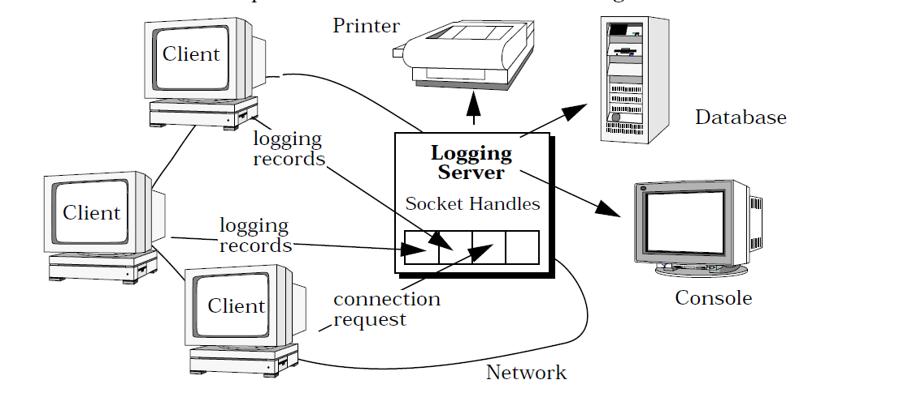
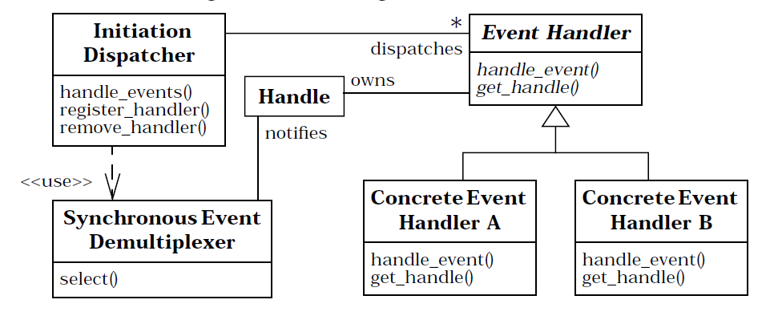
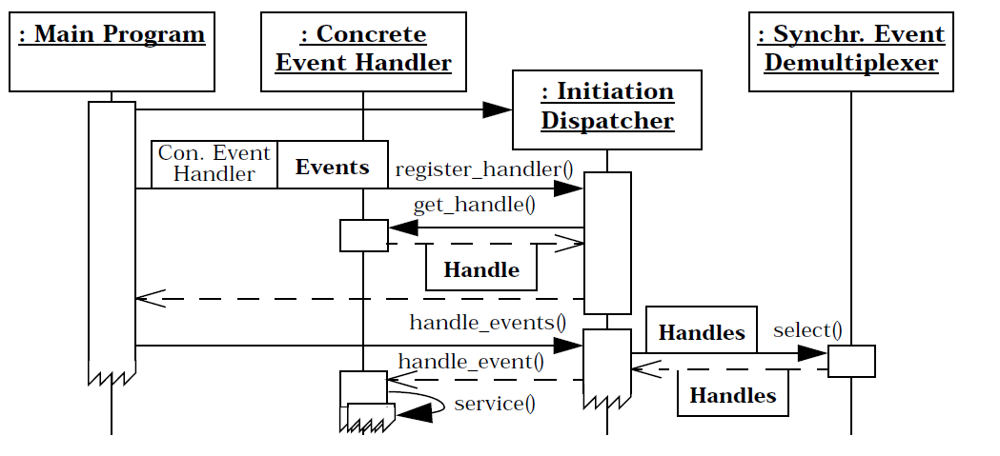

## Reactor线程模型

> The Reactor design pattern handles service requests that are delivered concurrently to an application by one or more clients

`Reactor`本质是一种设计模式，用来解决分布式环境下高并发问题。上图是论文中的例子，每个客户端都和服务器保持一个Socket链接，当客户端产生事件时又需要对应找到后方的数据据或是打印机进行输出。那么在`Reactor`这种模型之前，可以考虑的实现方式只有`TPR(Thread-per-request)`，显而易见每个请求一个BIO线程的方式不可取。

而网络请求多半可以视为一次读写事件，一个分发者接收到事件后将事件分发给真正的服务提供者，中间的`LoggingServer`就是`Reactor`的核心思想，也就是**事件分发**或者说**I/O多路复用**。

**这是一种将多个连接挂载到一个处理者名下，仅由一个线程维护连接，而处理发生在连接传来的事件被分发后（分发后将是另外的线程进行处理）。**而这种处理方式需要保证一点，服务器不可以因为任何一个请求的阻塞而无法处理其他请求，实际上这点也就是提出了**非阻塞I/O**的需要。

### 角色

那么设计过后提出的`Reactor模式`中包含如下角色：

- `Handle(句柄)`：标识系统资源
- `SynchronousEventDemultiplexer`: 监听事件
- `InitiationDispatcher`：注册事件处理器，分发事件
- `EventHandler`：定义事件处理的接口
- `ConcreteEventHandler`：真正的事件处理者

UML类图如下：

结合`LoggingServer`的例子，可以简单描述一下其工作过程: 

1. 应用向`InitiationDispatcher`注册一个真正的`Handler`，同时提供给`Dispatcher`它感兴趣的事件，以及监控事件的句柄`Handle`。
2. 全部注册完成后调用`handle_envets()`，开始事件循环，其中通过`SynchronousEventDemultiplexer`同步监听句柄中的事件，具体的监听方式取决于系统的实现（论文中给出的是`select()`）
3. `SynchronousEventDemultiplexer`根据监听到的事件通知`Dispatcher`，后者将根据注册信息将事件分发到具体的`handler`中执行

### 优缺点

实际上在讲到依赖底层的NIO时就明白，`Reactor模式`是一种和底层I/O实现联系相当紧密的设计模式，它在I/O的处理过程中添加了多种角色用于解耦，同时定义了`Handler`来模块化提供服务的处理者，**使用一个线程监听事件的方式增加了同时可处理的连接上限**，`Dispatcher`的存在十分类似一层负载均衡，**它通过解放被阻塞的线程以提高CPU的利用效率**。

关于提升CPU效率我是这么理解的：传统高并发场景下的BIO将迫使服务器维护多个阻塞等待资源的线程，而这些线程因为等待资源无法利用CPU，CPU发现线程阻塞后将唤醒其他线程进行CPU计算，但是此时大多数线程都是阻塞状态，将出现内核不断唤醒线程尝试运行，上下文不断切换但却没有实际利用CPU的情况（有巨大频繁的上下文切换代价，且CPU低负载）。那么仅由一个线程阻塞监听连接事件后，CPU就可以被其他线程或者程序利用。

同样的[SEDA: Staged Event-Driven Architecture - An Architecture for Well-Conditioned, Scalable Internet Service](https://people.eecs.berkeley.edu/~brewer/papers/SEDA-sosp.pdf)中验证了系统中线程数量在增长时，系统的吞吐量迅速下降，减少系统中的线程数，是可以提升系统性能的。

但这种设计方式显然提升了系统的复杂性，在非高并发场景下会不如BIO来的有效，同时NIO的非阻塞阶段仅包括资源的等待阶段，读写文件时仍然是阻塞的，因为这个原因多个公用同一线程进行I/O的client可能被彼此阻塞。

### Reactor和Netty

--To be continue

### Reactor多线程模式

### 主从模式

