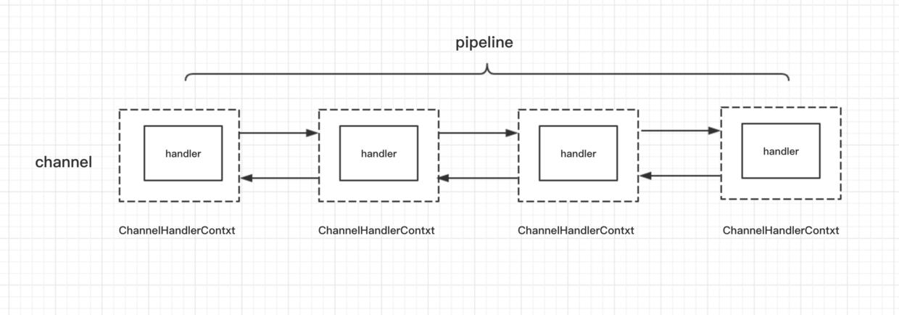
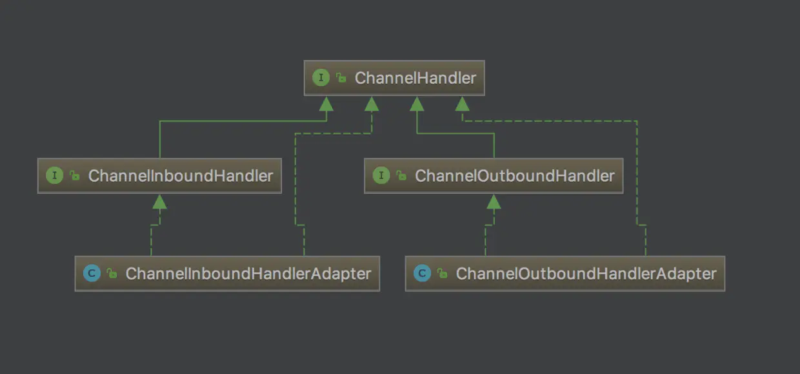
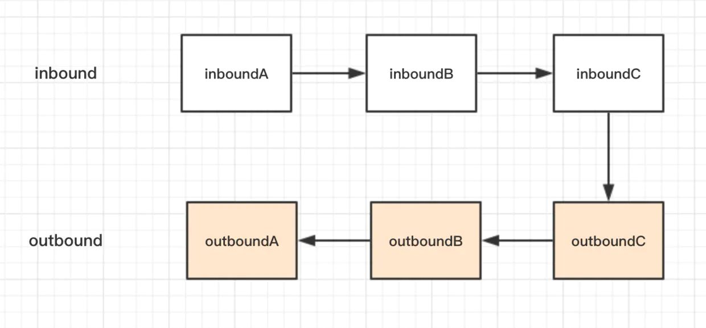

## 核心组件，Pipeline与channelHandler

那么在IO读取完数据后，就需要进行Handler的处理，如何避免代码中过多的`if else`就十分重要。而考虑使用netty进行处理的流程：

1. 数据流入，解码
2. 业务处理
3. 编码，数据流出

所以很容易想到整个处理过程在2中串联起来，而netty中的`pipeline`和`channelHanlder`就是基于责任链模式设计的处理方式，支持热拔插。

### 核心类

在Netty框架中，一条连接对应一个channel，而channel的处理逻辑都在`ChannelPipeline`中，是一个双向链表结构，其中包含`ChannelHandlerContext`节点，可以获取到`channel`的上下文，而`ctx`中又控制着真正进行逻辑处理的对象`handler`



`handler`的类继承情况



### 两个核心接口

`ChannelInboundHandler`和`ChannelOutboundHandler`两个接口从名字可以看出分别对应处理1->2, 2->3的情况，in的接口处理从物理层传递上来的数据，可以层层处理后传递到应用层，out接口表示写回数据前的一些处理。


#### 使用用例

**绑定到Channel中**

```java
serverBootstrap
        .childHandler(new ChannelInitializer<NioSocketChannel>() {
            protected void initChannel(NioSocketChannel ch) {
                // inBound，处理读数据的逻辑链
                ch.pipeline().addLast(new InBoundHandlerA());
                ch.pipeline().addLast(new InBoundHandlerB());
                ch.pipeline().addLast(new InBoundHandlerC());
                
                // outBound，处理写数据的逻辑链
                ch.pipeline().addLast(new OutBoundHandlerA());
                ch.pipeline().addLast(new OutBoundHandlerB());
                ch.pipeline().addLast(new OutBoundHandlerC());
            }
        });
```

**in， out的主要方法分别是`channelRead`和`write`**

```java
//inbound
public class InBoundHandlerA extends ChannelInboundHandlerAdapter {
    @Override
    public void channelRead(ChannelHandlerContext ctx, Object msg) throws Exception {
        System.out.println("InBoundHandlerA: " + msg);
        super.channelRead(ctx, msg);
    }
}

//outbound
public class OutBoundHandlerA extends ChannelOutboundHandlerAdapter {
    @Override
    public void write(ChannelHandlerContext ctx, Object msg, ChannelPromise promise) throws Exception {
        System.out.println("OutBoundHandlerA: " + msg);
        super.write(ctx, msg, promise);
    }
}
```

那么按上面的绑定handler，整个处理顺序如下：



### 使用适配器

上述的接口规定了ChannelHandler需要实现的全部方法，如果每次写Handler都实现全部方法显然太冗余，Netty自带了已经实现全部接口的两个适配器。

- `channelInboundHandlerAdapter`
- `channelOutboundHandlerAdapter`

这样实现时我们仅仅关心需要的方法

```java
@Override
public void channelRead(ChannelHandlerContext ctx, Object msg) throws Exception {
    ctx.fireChannelRead(msg);	//传递给链中的下一个处理人
}
```


### 优化编码工具

因为在netty中，使用场景都是基于TCP传来的数据的，将数据进行编码解码是必须的操作，所以Netty显而易见地提供了专门用于编码解码的父类。`MessageToByteEncoder`以及`ByteToMessageDecoder`

相比自己封装编码工具，并在流程中调用，使用Netty自带的实现我们仅需要关注编码方法的实现，添加到框架中就不再需要关注具体的流程中去调用。

以`ByteToMessageDecoder`为例：

```java
public class PacketDecoder extends ByteToMessageDecoder {

    @Override
    protected void decode(ChannelHandlerContext ctx, ByteBuf in, List out) {
        out.add(PacketCodeC.INSTANCE.decode(in));
    }
}
```

netty会传入channel核心的ctx，以及已经转换成`ByteBuf`的数据，和用于向后传递给`Handler`进行处理的对象`List`。

### 使用SimpleChannelInboundHandler

对于上述使用`Adapter`的方式其实已经比较简洁了，每个处理节点判断是否是自己处理，否则就向下传递，但是在单纯处理自身逻辑之外仍然附则了节点的传递。Netty处于减少掉这段重复代码的考虑，抽象了一个类用来进行`Handler`的快速编写。``SimpleChannelInboundHandler`中仅需要重写一个业务方法，Netty会负责处理前的类型判断，以及处理后的责任链传递。

```java
public class MessageRequestHandler extends SimpleChannelInboundHandler<MessageRequestPacket> {
    @Override
    protected void channelRead0(ChannelHandlerContext ctx, MessageRequestPacket messageRequestPacket) {
		//因为一个节点抽象出来只会处理一种对象，继承这个类时传递一个泛型，netty会为你完成if检查，进入方法的情况就是需要处理的情况
    }
}
```