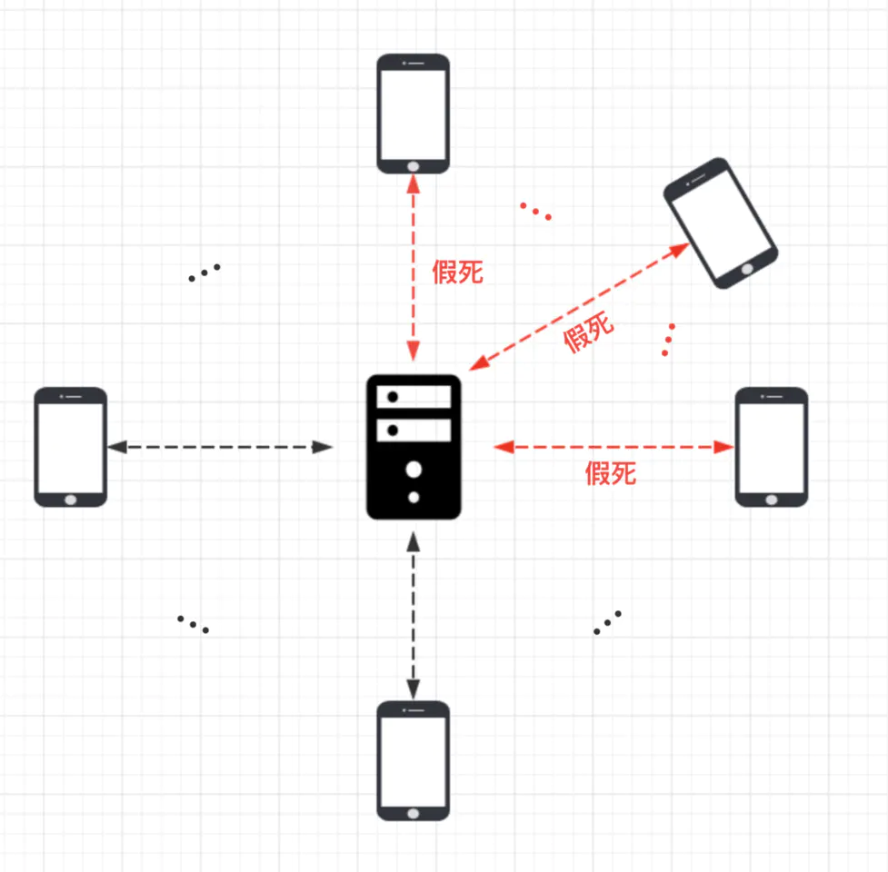

# 心跳与空闲检测

## 连接假死

考虑一个因为网络原因而导致应用程序普遍会遇到的问题：连接假死。



TCP连接的正常断开是需要4次挥手完成的，或者RST指令将连接重置。

不正确关闭的连接会出现底层TCP连接已经断开但一方仍然认为连接依然正常，这种持续的无法被正确关闭的连接将极大影响服务器性能。

### 导致问题

对于服务器：每条连接都要消耗CPU和内存资源，持续无法释放的连接将最终拖垮服务器，使程序崩溃。

对于客户端：假死的连接会让客户端误以为连接正常，但却收不到请求的结果，影响用户体验。

### 可能原因

1. 应用程序出现线程堵塞，无法进行数据的读写。（阻塞的一方不能响应任何连接也不能发出消息，连接被对方关闭）
2. 客户端或者服务端网络相关的设备出现故障，比如网卡，机房故障。
3. 公网丢包。公网环境相对内网而言，非常容易出现丢包，网络抖动等现象，如果在一段时间内用户接入的网络连续出现丢包现象，那么对客户端来说数据一直发送不出去，而服务端也是一直收不到客户端来的数据，连接就一直耗着。

## 服务端的及时释放连接

### 客户端

服务端一定时间内没有收到客户端的数据有两种情况：

1. 连接假死
2. 非假死状态下，确实没有发送任何数据

所以只要不是状态2，就可以确定连接已经假死。

所以客户端使用定时发送的心跳包来排除状态2，心跳包保证了客户端连接状态下无论有没有需求都会发送持续的数据，从而确保一旦没有数据包发送就表示连接假死。

而这个功能通过`Netty`的`ChannelInboundHandler`实现，`ctx.executor()`获取当前NIO的线程，并通过定时任务的方式进行调用

```java
public class HeartBeatTimerHandler extends ChannelInboundHandlerAdapter {

    private static final int HEARTBEAT_INTERVAL = 5;

    @Override
    public void channelActive(ChannelHandlerContext ctx) throws Exception {
        scheduleSendHeartBeat(ctx);

        super.channelActive(ctx);
    }

    private void scheduleSendHeartBeat(ChannelHandlerContext ctx) {
        ctx.executor().schedule(() -> {

            if (ctx.channel().isActive()) {
                ctx.writeAndFlush(new HeartBeatRequestPacket());
                scheduleSendHeartBeat(ctx);
            }

        }, HEARTBEAT_INTERVAL, TimeUnit.SECONDS);
    }
}
```


### 服务端

对于服务端来说，客户端的连接如果出现假死，那么服务端将无法收到客户端的数据，也就是说，如果能一直收到客户端发来的数据，那么可以说明这条连接还是活的，因此，服务端对于连接假死的应对策略就是空闲检测。

何为空闲检测？空闲检测指的是每隔一段时间，检测这段时间内是否有数据读写，简化一下，我们的服务端只需要检测一段时间内，是否收到过客户端发来的数据即可，Netty 自带的 `IdleStateHandler` 就可以实现这个功能。

```java
public class IMIdleStateHandler extends IdleStateHandler {

    private static final int READER_IDLE_TIME = 15;

    public IMIdleStateHandler() {
        super(READER_IDLE_TIME, 0, 0, TimeUnit.SECONDS);
    }

    @Override
    protected void channelIdle(ChannelHandlerContext ctx, IdleStateEvent evt) {
        System.out.println(READER_IDLE_TIME + "秒内未读到数据，关闭连接");
        ctx.channel().close();
    }
}
```

### 总结

客户端和服务端同时约定好，连接正常时无论是否必要都应当不断发送心跳保证对方知晓连接正常，那么这样服务端就可以以“未在规定时间内收到数据包”作为判断连接假死的依据。

## 客户端对假死的判断

实际上客户端对假死的判断是服务端判断的镜像问题。

### 服务端心跳包的响应

可以简单的在客户端给服务端发送心跳时进行一个心跳回复，这样就得到了一个同样周期心跳检查。

实现一个`HeartBeatRequestHandler`

```java
@ChannelHandler.Sharable
public class HeartBeatRequestHandler extends SimpleChannelInboundHandler<HeartBeatRequestPacket> {
    public static final HeartBeatRequestHandler INSTANCE = new HeartBeatRequestHandler();

    private HeartBeatRequestHandler() {

    }

    @Override
    protected void channelRead0(ChannelHandlerContext ctx, HeartBeatRequestPacket requestPacket) {
        ctx.writeAndFlush(new HeartBeatResponsePacket());
    }
}
```

### 空闲检查

同样的在`Pipeline`开头增加一个`Handler`即可。

```java
bootstrap
        .handler(new ChannelInitializer<SocketChannel>() {
            public void initChannel(SocketChannel ch) {
                // 空闲检测
                ch.pipeline().addLast(new IMIdleStateHandler());
                ch.pipeline().addLast(new Spliter());
                // ...
```

