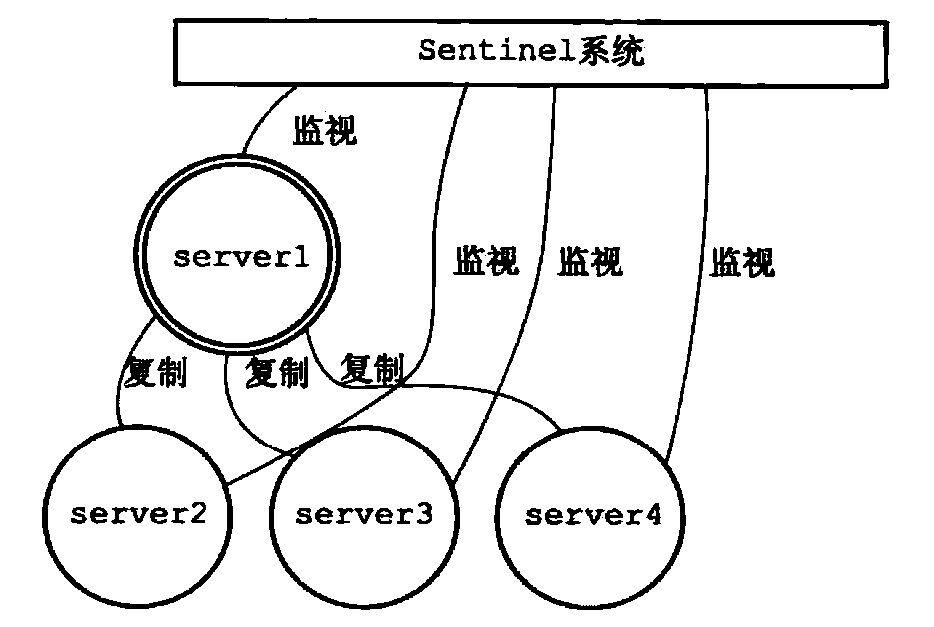
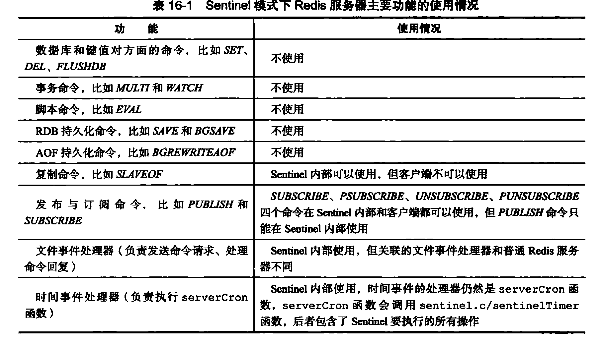
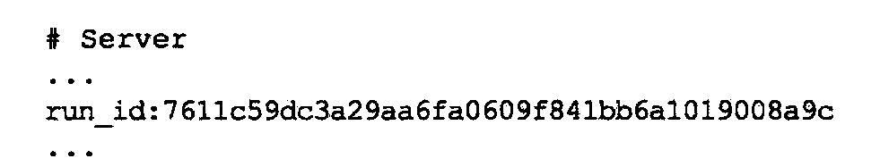
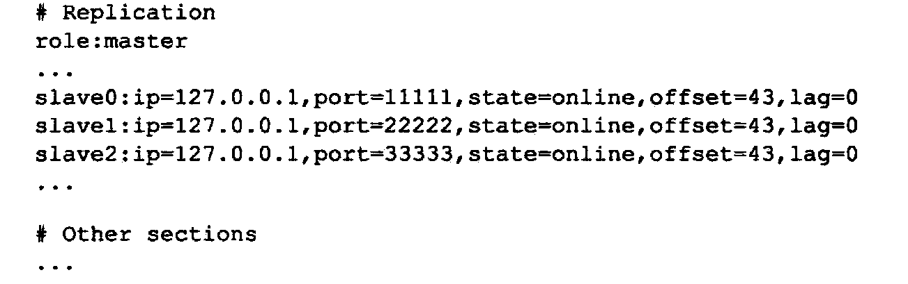
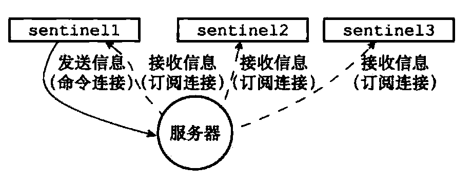
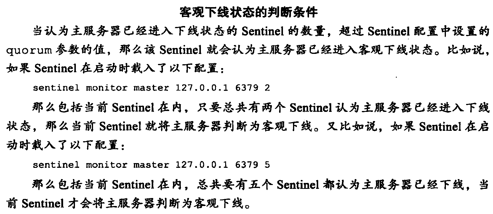
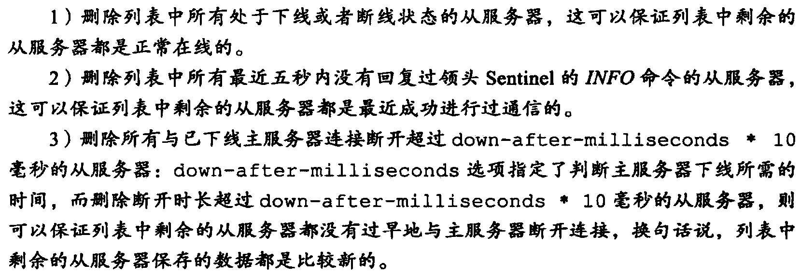

# Redis哨兵模式

> Sentinel是Redis的高可用性解决方案：由一个Sentinel实例组成的Sentinel系统可以监视任意多个主服务器，以及这些主服务器属下的所有从服务器，并且被监视的主服务器进入下线状态时，自动将下线主服务器属下的某个从服务器升级为新的主服务器，然后由新的主服务器代理已下线的主服务器继续处理命令请求
>
> ​		---《Redis设计与实现》

可以看到Redis中对于哨兵的定义是在**Redis复制**功能基础上进行高可用的保障以及故障时的服务转移，一个Sentinel系统如图：

对于Redis哨兵模式中的实现可以以复制功能作为基础去考虑一个自动故障转移系统需要什么。

## 启动Sentinel服务

Sentinel服务本质也是一种特殊的Redis服务，启动Sentinel服务和普通Redis服务对比如图：

而Sentinel初次启动时会根据配置文件初始化监听的主服务器信息，并在Sentinel中构建对应的实例结构(masters字典)

初始化之后Sentinel将向设定的主服务器建立连接，成为监听服务器的客户端（指可以通过命令的方式进行操作）。建立的连接由两种：

- 命令连接，（成为客户端的那个连接）专门用于发送命令，并接收主服务器回复。这个连接是用来控制主服务器的
- 订阅连接，依赖Redis的订阅发布功能，订阅主服务器之后可以通过该功能和系统中其他的Sentinel进行通信~~（其他的Sentinel也会监视全部主服务器，相当于全部Sentinel都是全部主服务器的订阅者/发布者）~~这点暂时存疑，没太看明白书里的话

## Sentinel和主服务器的通信

Sentinel会以默认10s一次的频率通过**命令连接**向被监视的主服务器发送INFO命令，并通过INFO命令获取主服务器的当前信息。

从主服务器信息中可以直接得到对应从服务器ip:port以及当前的在线状态和复制偏移量。这里获取得到的从服务器信息是用于给主服务器做更新的，如果主服务器中的slaves字典存在则更新从服务器信息，不存在则添加创建。（所以从这里可以猜测，原来在复制功能中，主服务器接收从服务器心跳并更新slaves字典的功能给Sentinel去做了）

## Sentinel和从服务器的通信

对于系统中的从服务器Sentinel同样会建立上述两种连接，并且以10s一次的频率发送INFO命令提取出以下信息：

- 从服务器运行ID run_id
- 从服务器的角色 role
- 主服务器的IP地址master_host
- 主服务器的连接状态master_link_status
- 从服务器的优先级slave_priority
- 从服务器的复制偏移量

并依据上述信息更新从服务器中对应实例

> 上面的两种INFO通信都可以理解成Sentinel需要主动去维护主服务器及从服务器的正确状态，那么主、从服务器也有需求接收到Sentinel的消息

Sentinel默认还会以每两秒一次的频率向其监听的主从服务器发送如下命令（通过命令连接）：

## Sentinel与Sentinel间的通信

Sentinel间的通信方式其实也有两种虽然Sentinel之间只有命令连接，那是因为全部Sentinel都是主服务器的订阅者/发布者，所以其实可以通过**订阅发布功能**实现彼此间的通信

每当Sentinel接收到频道消息时都可以通过与自身ID的比较得知是否是其他Sentinel的消息，如果是则可以根据消息更新响应主服务器的实例结构。或者是更新主服务器中记录的Sentinel信息，更新Sentinel字典（这个是在主服务器中的）。稍后会总结每个服务器中都记录了什么实例。

而每当从广播中得知新的Sentinel时，会在此时建立于新Sentinel的命令连接。

## 下线的检测

### 主观下线

Sentinel会每秒一次向其他所有服务器（主、从及其他Sentinel）发送PING命令检测在线状态。如果该服务器在这个Sentinel设置的故障时间内没有回复则认为该服务器已经下线，但是这是单个Sentinel的主观判断，可能出现多个Sentinel对一个服务器判断不一致的情况，这是合理的。

### 客观下线

在Sentinel主观认为下线后，会询问系统中其他Sentinel是否将该服务器标记为下线，当该Sentinel接收到大于其配置的客观下线数量之后，就会判断其为客观下线，并向其他Sentinel发送下线消息，此时系统中全部认为该主服务器下线：

​										

所以说系统对客观下线的判断是第一个认为客观下线的Sentinel导致的（这是设置的主观下线时间，各自认为客观下线的标准以及访问时间共同导致的）。

## 故障转移

### 选举领头Sentinel

在主服务器被判断客观下线后，监视的全部Sentinel会选举出一个代言人进行故障转移处理。这里的选举算法是类是Reft算法的实现，每个选举纪元每个节点只能投票一次，而每个节点都会向其他节点发送命令要求其将票投给自己，而接收命令的节点会根据是否已经投票返回结果（会默认投给第一个请求的节点）。那么这样每个节点都可以根据请求响应得到自己的票数，如果大于节点总数1/2就可以开始进行故障转移工作，否则进行下一次选举纪元。

### 故障转移

选举出的Sentinel会：

1. 在已下线的主服务器的从服务器中选出一个作为主服务器（修改了一个从服务器）

   挑选过程大致如下：

   

2. 将其他的从服务器指向新的主服务器（修改了其他的从服务器）

3. 如果下线的主服务器重新上线，它会成为一个从服务器

### 实例相关

Sentinel: masters实例

主服务器：slaves、sentinels

没写完