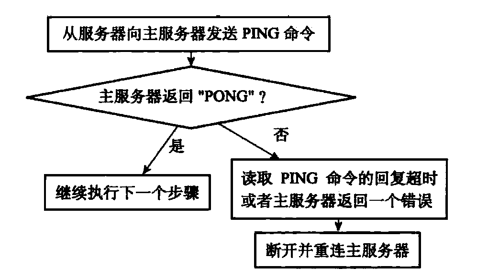
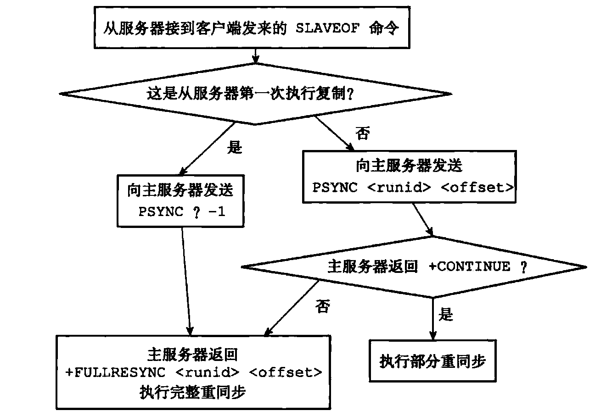

# Redis主从复制

### Redis复制

Redis开启复制功能及运行过程如下：

1. 设置主服务器的地址和端口

   - `SLAVEOF`命令之后，服务器会在服务器状态中记录`masterhost`及`masterport`属性，记录完成后返回ok才正式开始复制。

2. 建立套接字连接

   - 如果从服务器可以通过套接字连接到主服务器，那么将开启一个处理复制工作的文件事件处理器，负责后续的复制工作（RDB文件，写操作）。
   - 此时从服务器是作为主服务器的客户端存在，对外服务时作为服务器存在。

3. 发送PING命令

   - 发送PING用于检查服务器之间的连接状况

   

4. 身份验证

   - 在上一步PING返回的PONG之后，如果需要身份验证则会发送一条`AUTH`指令
   - 可能结果：
     1. 主服务器需求密码，从服务器发送了密码且正确，可以进行复制工作，密码不正确则终止复制
     2. 主服务器不需求密码，从服务器发送了密码，复制终止；
     3. 主服务器需求密码，从服务器没有发送密码，复制终止；
     4. 主未需求密码，从也未发送密码，复制进行。

5. 发送端口信息

6. **同步**

   - 在开始发送`PSYNC`进行同步之后，主从都是彼此的客户端了，主需要向从发送命令进行写操作。

   - 同步过程出现在从服务器刚复制主服务器时，及服务器断线后又上线时。

     - 建立复制连接时：

       1. 主服务器接收到`SYNC`同步需求后，执行`BGSAVE`指令，并用缓冲区将这期间的写命令记录
       2. RDB文件生成后发送给从服务器，从服务器以RDB文件构建数据库
       3. 主将缓冲区中的写命令发送给从服务器执行。

     - 如果在一个从服务区建立复制时，出现了另一个从服务器希望建立复制关系：

       1. 如果主在准备完RDB文件前接收到`SYNC`指令，那么将RDB一起发送给所有请求的从服务器
       2. 如果从服务器到来时已经发送过RDB了，那么只能重新执行一次`SYNC`指令。

     - 服务器断线后上线，此时从服务器是缺失了部分数据：

       1. Redis2.8之前，只能让从服务器重新执行一次SYNC。
       2. 2.8之后可以通过PSYNC实现部分同步。为了实现部分同步且表示服务器间的一致性关系，主从都记录了生成数据的偏移量（offset），每当发生新的写操作时主都会更新自己的偏移量并将命令传播，而从更新之后也会修改自己的偏移量。所以主会将最近生成的写指令维护到一个 **固定长度的FIFO队列**中，叫**复制积压缓冲区**。那么掉线的服务器上线后，根据自己的偏移量在**队列**中检查，如果存在队列中，那么直接将最新的一部分指令复制执行，否则表示掉线时间太长需要全部同步。

     - PSYNC可能的全部情况：

       

7. 命令传播

### 心跳检测

心跳检测提供在**命令传播阶段**的保障，命令传播阶段时复制功能的主要运行阶段。**从**服务器会**每隔一秒**向**主**服务器发送心跳检测`REPLCONF ACK <replication_offset>`，作用有三：

1. 检测主服务器的网络状态，如果主服务器没有回复则知道主从连接出现问题
2. 辅助实现min-slaves设置，通过心跳主服务器可以实时得知在线的服务器数量，并确保在可以保证安全性下才执行写命令。因为如果在线机器过少就无法保证高可用。
3. 检测命令丢失，如果主发送的命令在网络中丢失，那么丢失的命令会体现在从服务器的偏移量上，心跳检测时就可以重新发送丢失部分的写命令。