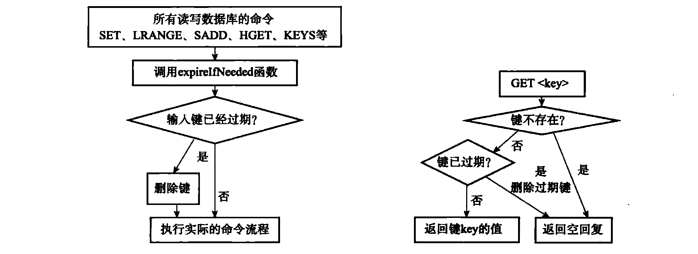
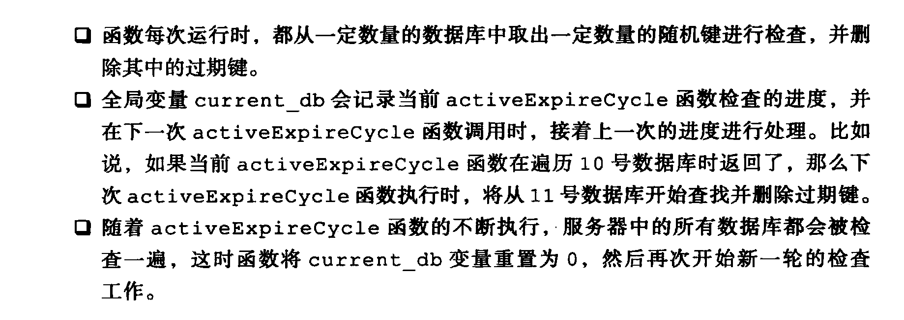

# Redis的键过期管理+内存淘汰

#### 键的删除策略

- 定时删除
  - 使用定时器，对内存友好，过期的键可以被及时的删除
  - 对CPU不友好，删除过期键这件事情会消耗CPU资源，在内存不是非常紧张的情况下去处理过期键的删除会影响服务器的响应时间以及吞吐量
- 惰性删除
  - 对CPU友好，因为对于过期的键仅在重新尝试取出时才检查过期信息并删除
  - 对内存最不友好，因为内存中会存在非常多过期的键，并且可能用户再也不会主动访问而导致键无法被删除，这甚至是一种**内存泄漏**
- 定期删除
  - 对内存，对CPU理论上均不会有太大压力
  - 每隔一段时间进行删除工作减小了对CPU的负担，避免了惰性导致的内存泄漏

**Redis删除策略**：惰性+定期

惰性删除通过`expireIfNeeded`函数实现，类是一个`filter`对全部的操作指令进行过滤，运行逻辑如下：

定期删除通过`activeExpireCycle`实现，运行如下：

但如果`db.expires`的size小于1表示没有任何键进行了过期记录

#### 持久化时对过期键的处理

加入了过期之后，数据库会随着时间发生变化，所以持久化时需要保存和当时数据库状态一致。

- RDB：运行`SAVE`或`BGSAVE`时，不会将过期的键进行保存，快照的保存是遍历全部的键来保存的，顺带检查过期信息即可。并且通过RBD文件载入数据库时，也是按键进行填入的，过期的键不会被添加到库中。
- AOF：因为AOF实际记录的是写操作记录，所以AOF对于过期键的察觉取决于对数据库的直接操作。如果一个键已经过期但还没有被惰性删除或者定期删除，则AOF文件中不会有任何体现。如果被上述两种删除之后，AOF会显示的添加一条`DEL`语句来表明键因为过期被删除了。AOF重写时则会检查键并对过期的键不予保存。
- 复制：在主服务器键被删除后，会向从服务器发送`DEL`命令，在从服务器未接受到命令并删除之前，从服务器中的键仍然可以正常响应。

### 内存淘汰策略

上面的过期策略相当于是**什么时候删除过期的键**，而内存的**淘汰策略**是**删除什么样的键**。

这和操作系统中的**内存置换算法**有异曲同工之意。本质都是在有限的空间下选择出最没有价值的内容进行抛弃来给新的内容提供空间。

官网上给到的内存淘汰机制是以下几个：

- **noeviction**:返回错误当内存限制达到并且客户端尝试执行会让更多内存被使用的命令（大部分的写入指令，但DEL和几个例外）
- **allkeys-lru**: 尝试回收最少使用的键（LRU），使得新添加的数据有空间存放。
- **volatile-lru**: 尝试回收最少使用的键（LRU），但仅限于在过期集合的键,使得新添加的数据有空间存放。
- **allkeys-random**: 回收随机的键使得新添加的数据有空间存放。
- **volatile-random**: 回收随机的键使得新添加的数据有空间存放，但仅限于在过期集合的键。
- **volatile-ttl**: 回收在过期集合的键，并且优先回收存活时间（TTL）较短的键,使得新添加的数据有空间存放。

大致可以总结为如下几种：

1. LRU，分为在全部的Key和仅设置超时时间的Key。这里可能有点疑问，为什么设置超时时间会在LRU时被删除，因为虽然设置了时间但在ttl到来之前，内存已经不够用了，需要替换，所以是可能在有expire-time的key集合中进行选择的。
2. 随机，同样分为全部key随机和有超时时间的key
3. 选择ttl最短的key，这种就是针对设置了expire-time的集合进行筛选，将离过期时间最近的key进行删除。