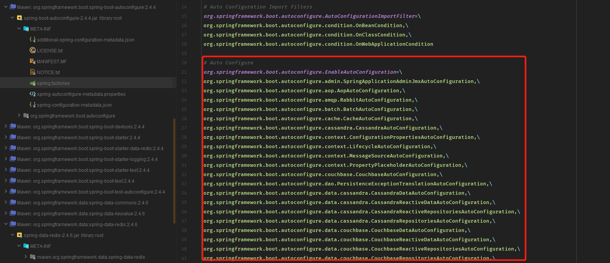

# SpringBoot的自动装配实现

### 注解开始

首先SpringBoot的启动通过了一个启动类，上面最基本的注解是`@SpringBootApplication`。

进入后观察

```java
@Target(ElementType.TYPE)
@Retention(RetentionPolicy.RUNTIME)
@Documented
@Inherited
@SpringBootConfiguration
@EnableAutoConfiguration
@ComponentScan(excludeFilters = { @Filter(type = FilterType.CUSTOM, classes = TypeExcludeFilter.class),
		@Filter(type = FilterType.CUSTOM, classes = AutoConfigurationExcludeFilter.class) })
public @interface SpringBootApplication {
```

发现实际上是如下注解的组合

1. `@SpringBootConfiguration`
2. `@EnableAutoConfiguration`
3. `@ComponentScan`

最后一个`@ComponentScan`没什么可以多说的，正常我们实现了业务相关的bean，Controller, Service, Component将被这个注解进行扫描。

在@EnableAutoConfiguration中注解如下


其中@AutoConfigurationPackage如下


可以看到最重要的是导入了`AutoConfigurationPackages`这个类，而这个类通过其doc描述可以得知负责的是`Spring Data JPA`的支持


那么可能和默认配置相关的只能存在`AutoConfigurationImportSelector`中。同时阅读`@EnableAutoConfiguration`注解


**请务必阅读上面的注释**

比如上面提到了，当你的依赖中有`tomcat-embedded.jar`时，他认为你需要`TomcatServletWebServerFactory`。这其实已经暗示了它的工作方式。具体会在后面提到


### AutoConfigurationImportSelector

从`Application.run`其中的`refresh(context)`一路跟踪下来，可以发现最终将到`AutoConfigurationImportSelector.getCandidateConfigurations`查找全部可以添加的bean。

且可以看到**实际上会去查找可以自动配置的工厂类**。（因为类都是要工厂创建）


而对上面的方法跟踪一会就看到了最终结果：

> 启动时，会扫描所有jar包下的META-INF/spring.factories文件，按Properties进行解析，得到所有可以自动注解的工厂类

而这个可以自动注解的范围保存在spring-boot-autoconfigure包下：



也可以看到和`@EnanbleAutoConfiguration`注解的对应，其中包括了常见中间件的客户端等等。

### One More Question

简单统计了一下在，spring-boot-auto-configuration的spring.factories中有100+的工厂类，难道这些类在SpringBoot初始化时全部都注入到`BeanFactory`了吗？


可以简单试想一下这个问题，如果我们没有导入`MySQL`相关的依赖，那它怎么给我们创建连接池？这显然是行不通的。


**实际上，SpringBoot启动时扫描的全部jar包就是在收集可以自动注入的bean**

下面展示了SpringBoot扫描redis相关的jar包，并读取需要自动配置工厂的过程。


如果没有相关依赖的bean，即使在自动配置的范围内，也是不会进行加载的。

### 总结

- 核心是`@EnableAutoConfiguration`注解
- 关联的Spring-boot-autoconfigure包下的META-INF/spring.factories决定了可以自动装配的范围
- 而具体依赖的每个jar包中的META-INF/spring.factories决定了最终装配哪些bean