# XML中Bean的加载

这将作为Spring源码学习的第一期，因为Spring最为人所知的两个特性就是IOC和DI（`Inversion of Control/Dependency Injection`）。

虽然使用XML注入的方式几乎已经很少使用了，但这仍然是最初Bean加载的方式。

## Bean的加载流程--XML的解析

```java
public void testSimpleLoad(){
    BeanFactory bf = new XmlBeanFactory(new ClassPathResource("beanFactoryTest.xml"));
    MyTestBean bean = (MyTestBean) bf.getBean("myTestBean");
}
```

上面是XML方式注入bean最核心的两行代码，那么我们依次跟踪源码观察调用行为。

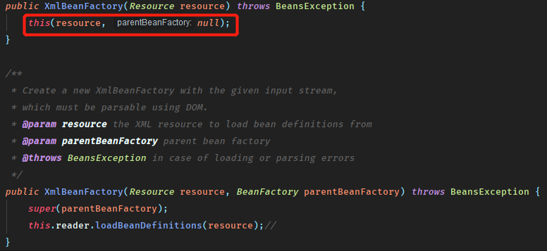

首先是得到`BeanFactory`的过程，`new ClassPathResource("beanFactoryTest.xml")`显然创建了一个`Resource`接口的实现类。

`Resource`接口是Spring抽象对底层资源的访问方式（File, URL, ClassPath等），后面会进行总结。

其中的`reader`是`XmlBeanDefinitionReader`。

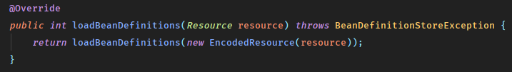

### XmlBeanDefinitionReader

在真正的`loadlBeanDefinitions`方法中，观察这样一个片段

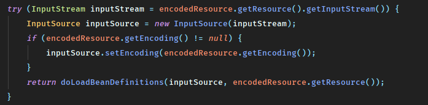

通过`Resource`获取到`InputStream`在将其封装成`InputSource`，

> 注释对InputSource的描述是 A single input source for an XML entity.

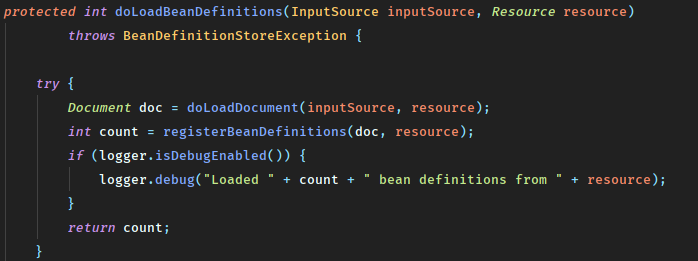

而在`doLoadBeanDefinitions`方法中，通过`DocumentLoad`的实现类`DefaultDocumentLoader`将`InputSource`解析成`Document`，这里的`Document`可以理解成被处理成了可以在Java中进行操作的XML文件结构。

### DefaultBeanDefinitionDocumentReader

那么最后终于到达`BeanDefinitionDocumentReader`接口实现类`DefaultBeanDefinitionDocumentReader`中进行Bean的加载了

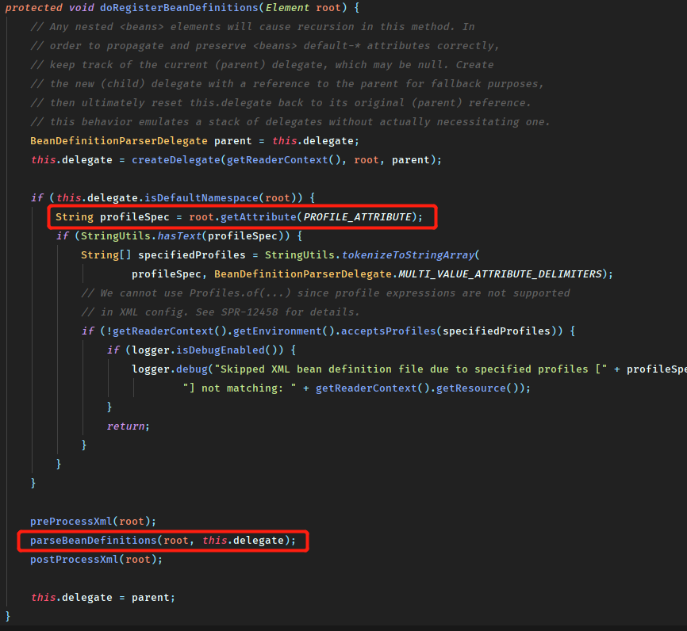

可以首先看到的是对dom树进行了检查，是否设置了环境参数。

随后真正将dom树传入并进行bean的解析。这个方法调用过程没有什么特别的，然后下面是对**节点**的不同处理

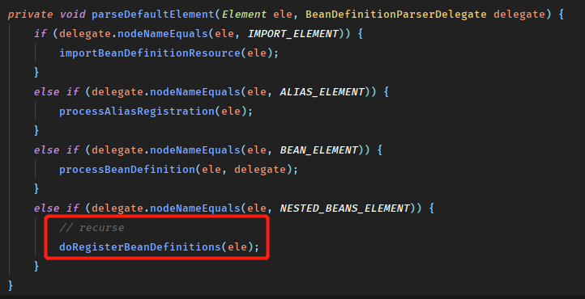

这里同样可以看到对dom树节点的循环解析。

而接下来的工作就进入到了`BeanDefinitionParserDelegate`中了

### BeanDefinitionParserDelegate

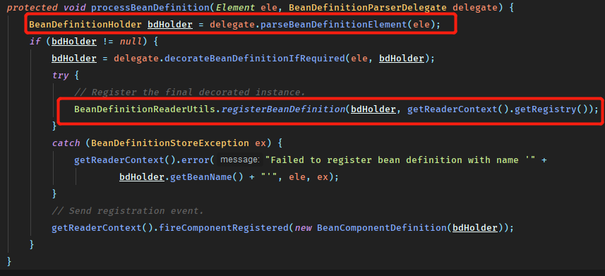

首先一个重要的对象就是`BeanDefinitionHolder`，看名字就可以知道是对`BeanDefinition`的对象维护。其数据结构为：

```java
private final BeanDefinition beanDefinition; //bean的定义信息
 
private final String beanName; //bean的名字

@Nullable
private final String[] aliases; //bean的别名
```

获取`bdHolder`的过程，可以理解成按填入的class信息生成`BeanDefinition`的过程，同时封装成一个`Holder`，而在其中得到`AbstractBeanDefinition`的过程中：

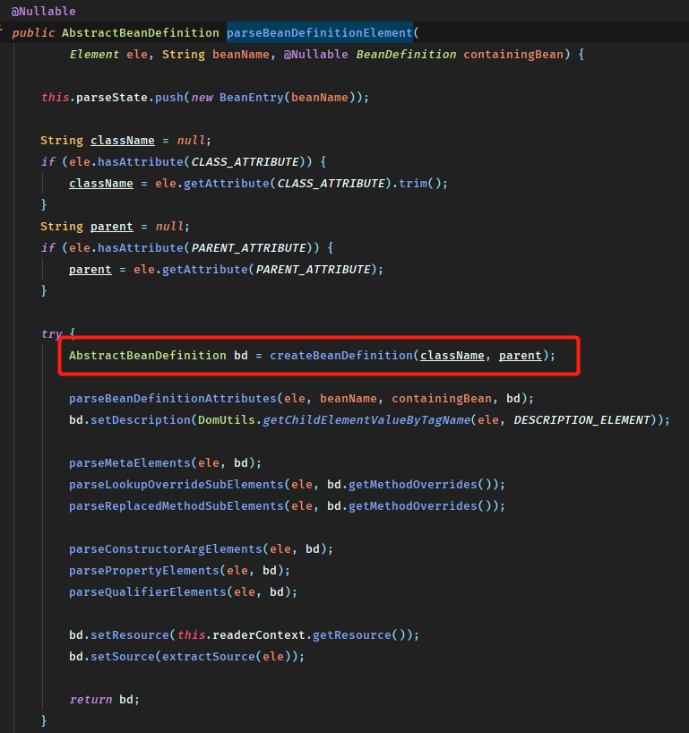

可以看到对`bd`做了其依赖对象，以及构造参数的解析（这里一并进行了<bean>下定义内容的解析），并返回了`BeanDefinition`。

而上述的`createBeanDefinition`内部，其实是对传入的`className`进行了解析，**对这个Bean所实例化的类进行了加载**。

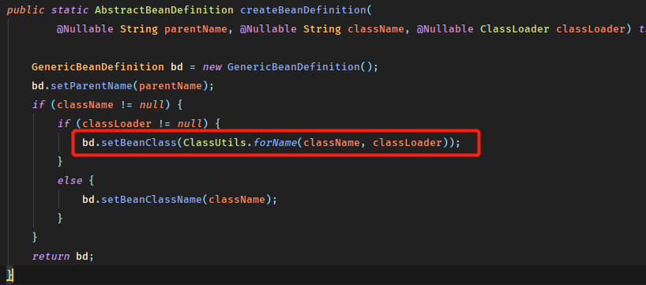

上图框中的方法返回的是`Class<?>`对象，传入的是`className`和`classLoader`。

然后最后将`name`-`BeanDefinition`作为键值对保持到了一个`ConcurrentHashMap`中。至此一个bean的定义的读取就完成了。

### 部分总结

 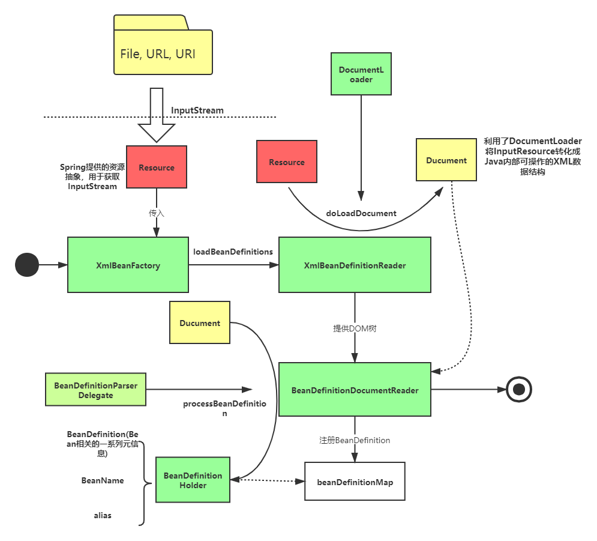

1. Spring封装了自己的Resource结构用以实现对资源的同一抽象
2. 一个XML文件将被依次读取成Resource --> Document --> Bean的解析
3. 而对XML文件将进行格式验证，并最终获得Document对象
4. bean的注册过程实际加载的是类对象，而并没有立即实例化。考虑懒加载，但这个类又必然实例化，所以先将类加载进来。

## Bean的加载流程--Bean的加载

上面全部是分析`BeanFactory`的获取过程，那么在

```java
MyTestBean bean = (MyTestBean) bf.getBean("myTestBean");
```

的过程中，发生了什么？

### 整体流程

首先，`getBean`方法将调用在抽象类`AbstractBeanFactory`中实现的`doGetBean`方法获取Bean。这段代码相当之长，逻辑十分复杂。

1. 转换对应的beanName

```java
String beanName = transformedBeanName(name);
```

`name`是传入的名称，但这个名称可能是别名也可能是`FactoryBean`的名称。所以需要转换成真正需要创建的beanName。

2. 从单例缓存中尝试加载

```java
// Eagerly check singleton cache for manually registered singletons.
Object sharedInstance = getSingleton(beanName);
```

上述方法将最终指向`DefaultSingletonBeanRegistray.getSingleton()`，也可以看到`AbstractBeanFactory`继承了`DefaultSingletonBeanRegistry`。

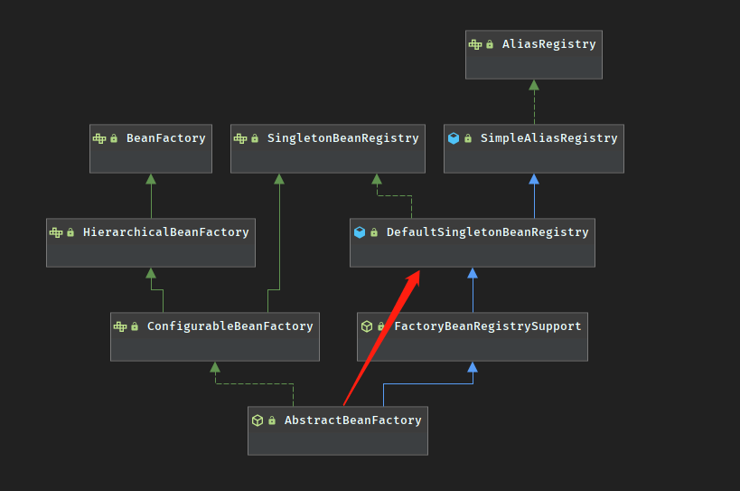

3. bean的实例化

如果从缓存中得到了bean的原始状态，那么将对它进行实例化。

```java
if (sharedInstance != null && args == null) {
			if (logger.isTraceEnabled()) {
				if (isSingletonCurrentlyInCreation(beanName)) {
					logger.trace("Returning eagerly cached instance of singleton bean '" + beanName +
							"' that is not fully initialized yet - a consequence of a circular reference");
				}
				else {
					logger.trace("Returning cached instance of singleton bean '" + beanName + "'");
				}
			}
			beanInstance = getObjectForBeanInstance(sharedInstance, name, beanName, null);
		}
```

4. 原型模式的依赖检查

如果当前是原型模式下的循环依赖，则会抛出异常。Spring仅会处理单例中的循环依赖。

5. 检测`parentBeanFactory`
6. 将`GernerciBeanDefinition`转化成`RootBeanDefinition`
7. 寻找依赖，并递归加载。

```java
// Guarantee initialization of beans that the current bean depends on.
				String[] dependsOn = mbd.getDependsOn();
				if (dependsOn != null) {
					for (String dep : dependsOn) {
						if (isDependent(beanName, dep)) {
							throw new BeanCreationException(mbd.getResourceDescription(), beanName,
									"Circular depends-on relationship between '" + beanName + "' and '" + dep + "'");
						}
						registerDependentBean(dep, beanName);
						try {
							getBean(dep); //这行代码最后会回到对deGetBean()的方法中
						}
						catch (NoSuchBeanDefinitionException ex) {
							throw new BeanCreationException(mbd.getResourceDescription(), beanName,
									"'" + beanName + "' depends on missing bean '" + dep + "'", ex);
						}
					}
				}
```

8. 对不同scope的bean进行创建

9. 类型转化，创建之后的`beanInstance`是个`Object`，需要转换成最终需要的类型。

   

### 有缓存的流程

其中在这一长串代码中，下面这行代码重复了四次，且均为`beanInstance`赋值

```java
beanInstance = getObjectForBeanInstance(sharedInstance, name, beanName, null);
```

这个方法传入4个参数

```java
protected Object getObjectForBeanInstance(
			Object beanInstance, String name, String beanName, @Nullable RootBeanDefinition mbd) 
```

而这个方法中将主要处理

1. 是否是`FactoryBean`，如果以'&'为前缀但不是则抛出异常
2. 那么`beanInstance`只可能是`bean`或`FactoryBean`
3. 是`bean`则直接返回
4. 否则使用下面的代码进行创建

```java
object = getObjectFromFactoryBean(factory, beanName, !synthetic);
```

而这段代码最终将通过`FactoryBeanRegistrySupport.getObjectFromFactoryBean()`->`doGetObjectFromFactoryBean()`。最后将调用`FactoryBean`的`getObject()`方法创建实例。

代码如下

```java
protected Object getObjectFromFactoryBean(FactoryBean<?> factory, String beanName, boolean shouldPostProcess) {
		if (factory.isSingleton() && containsSingleton(beanName)) {
			synchronized (getSingletonMutex()) {
				Object object = this.factoryBeanObjectCache.get(beanName);
				if (object == null) {
					object = doGetObjectFromFactoryBean(factory, beanName);
					// Only post-process and store if not put there already during getObject() call above
					// (e.g. because of circular reference processing triggered by custom getBean calls)
					Object alreadyThere = this.factoryBeanObjectCache.get(beanName);
					if (alreadyThere != null) {
						object = alreadyThere;
					}
					else {
						if (shouldPostProcess) {
							if (isSingletonCurrentlyInCreation(beanName)) {
								// Temporarily return non-post-processed object, not storing it yet..
								return object;
							}
                            //这步将此时的创建过程，保持状态到currentInCreations中
							beforeSingletonCreation(beanName);
							try {
								object = postProcessObjectFromFactoryBean(object, beanName);
							}
							catch (Throwable ex) {
								throw new BeanCreationException(beanName,
										"Post-processing of FactoryBean's singleton object failed", ex);
							}
							finally {
								afterSingletonCreation(beanName);
							}
						}
						if (containsSingleton(beanName)) {
							this.factoryBeanObjectCache.put(beanName, object);
						}
					}
				}
				return object;
			}
		}
		else {
			Object object = doGetObjectFromFactoryBean(factory, beanName);
			if (shouldPostProcess) {
				try {
					object = postProcessObjectFromFactoryBean(object, beanName);
				}
				catch (Throwable ex) {
					throw new BeanCreationException(beanName, "Post-processing of FactoryBean's object failed", ex);
				}
			}
			return object;
		}
	}
```

### 无缓存的流程

那么如果在`getSingleton()`中没有获取到缓存，则会对`ParentBeanFactory`做判断，且对依赖做检测并递归实例化。（上述流程）

最后会到`createBean`方法中真正的创建`Bean`

那么`AbstractBeanFactory.createBean()`抽象方法，仅有唯一的实现`AbstractAutuwireCapableBeanFactory.createBean()`

主要做了如下几件事：

1. `resolveBeanClass()`确保bean所需的类被正确的加载
2. `prepareMethodOverrides()`准备lookup-method和replace-method
3. `resolveBeforeInstantiation()`对有增强需求的bean返回其代理类取代bean
4. `doCreateBean()`直接对bean进行反射实例化

可以发现仍然有很多实例化前的操作。而实现代理类又涉及到AOP的实现过程，所以这里不做展开，会在另外的篇章进行总结。

#### doCreateBean

--To be continue

### 总结

--To be continue

