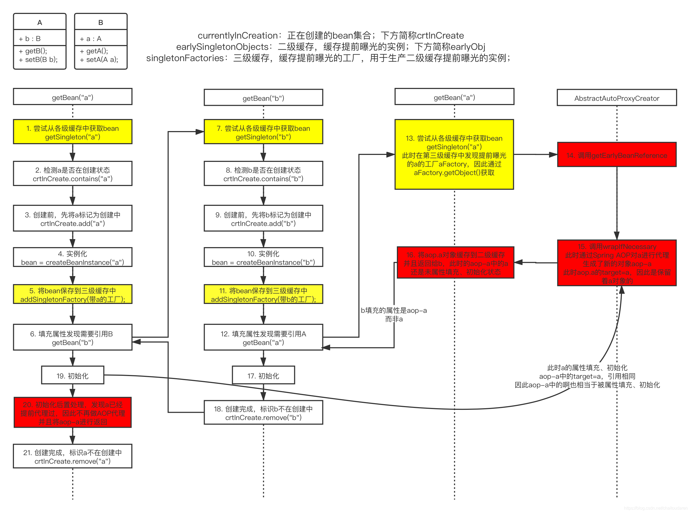
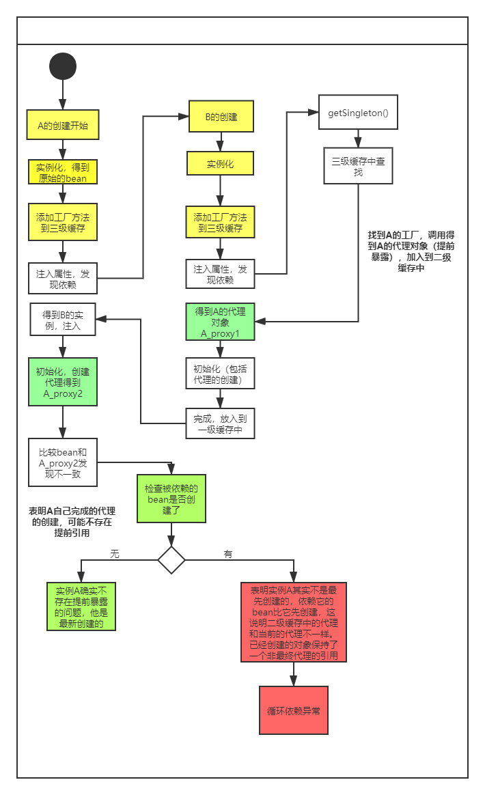

# 循环依赖的解决问题的三个level

> ref: https://www.cnblogs.com/daimzh/p/13256413.html
>
> https://blog.csdn.net/chaitoudaren/article/details/105060882


1. 什么是循环依赖？

指两个对象A, B 互相有引用，而导致bean创建时递归创建而因两者相互依赖谁也不能创建成功。同样的，多于两个对象的依赖在大的项目中更加常见，且更难以发现。

2. 循环依赖什么时候可以被处理？

Spring仅对单例模式的bean进行了循环依赖的处理，而原型模式将抛出异常

**依赖的方式不全是构造器**


Spring解决循环依赖的方法是三级缓存，分别存放的是：初始化了的实例（一级缓存），提前暴露的实例（二级缓存），实例的工厂方法（三级缓存）。

这里三级缓存中存放的是`ObjectFactory`，这个接口仅用于提供一个返回bean的工程，且一般使用lamda表达式的内部类，区分`FactoryBean`。


### 依赖的解决

之前总结过bean的加载流程，我们知道对bean进行加载时，会在`createBean`中进行创建，而检查依赖并递归创建bean前，会执行下面这段代码

```java
// Eagerly cache singletons to be able to resolve circular references
		// even when triggered by lifecycle interfaces like BeanFactoryAware.
		boolean earlySingletonExposure = (mbd.isSingleton() && this.allowCircularReferences &&
				isSingletonCurrentlyInCreation(beanName));
		if (earlySingletonExposure) {
			if (logger.isTraceEnabled()) {
				logger.trace("Eagerly caching bean '" + beanName +
						"' to allow for resolving potential circular references");
			}
			addSingletonFactory(beanName, () -> getEarlyBeanReference(beanName, mbd, bean));
		}
```

第一个关键点为`earlySingletonExposure`，对`bean`是否是单例，是否允许循环引用，以及当前bean是否正在创建进行了检查。而单例表明循环依赖只对单例处理，而循环引用是一个设置值，最后则是一个正在创建过程中bean的缓存，这个值在之前的步骤中会将当前的bean添加到缓存中。所以说只要是单例，这个值就会为`true`。这个值不是发生依赖时才为真，而是单例就为真，这样发生依赖时才可以被正常处理。

而判断中的代码体现了**将ObjectFactory添加到三级缓存**的过程。所以说，bean的创建过程是，

1. 实例化
2. 添加工厂到三级缓存
3. 递归创建依赖
4. 注入属性
5. 初始化

添加缓存是第一步。那么进入到递归B的创建中时，通过`getSingleton`这个方法将获取到`bean`A的工厂方法，用于注入，而完成实例化以及后面的过程，最后继续执行A的实例化以及后面的过程。

而其中B创建时，获取到A的工厂方法后，将其从三级缓存中取出并放入二级缓存中。且A,B创建完成后都将进入到一级缓存中。


盗用一下别人的图


bean的创建不是一蹴而就的，需要实例化，之后注入属性，依赖导致问题就出现在实例化的同时必须要求依赖的属性同样实例化，一个强依赖条件的存在将导致创建相互递归形成环路。缓存的意义就在于**破除实例化必须依赖已经完全创建的属性**这个条件，对每个bean都做默认的工厂放入缓存，代替被需要时的bean，从而在依赖bean没有完成创建时可以通过提早曝光的方式，使任何依赖都可以顺利注入（实际上对象未完成创建，但因为引用的关系，最后创建了之后，引用就是一个完整的对象了）。

但这样就会发现一个问题：

**三级缓存在普通循环依赖的情况下，仅仅是提供了一个工厂方法**，且上面的思路来说，二级缓存就足以满足需求，那么三级缓存的意义何在？

### 三级缓存解决AOP中的依赖

二级缓存中存放的是实例化但为完成创建的bean，称为提前暴露的bean

对于需要创建代理类的bean，如果按同样的二级缓存解决循环依赖，那么就意味着这里将必须实例化代理对象了。

为什么这里会需要实现代理对象呢？因为解决依赖的方式就是暴露一个未完成的实例，对于代理需求则对应着一个未完成的代理对象，而循环依赖是通过**悲观的缓存方式**解决的，也就是所有的单例都必须提前实例化且在三级缓存中放入一个工厂方法。那么就意味着代理对象将在此处全部实例化。而这是违反Spring的设计原则的，Spring期望在bean创建的最后阶段进行代理对象的创建，而此时属性未注入，初始化方法未执行，显然不是最后阶段。

所以不是直接在二级缓存中存放实例，而是在三级缓存中存放工厂，那么这样对所有单例对象的强迫实现就是一个工厂，当然普通对象和代理对象修饰的源对象都已经实例化了，而代理对象则可以在真正发生循环依赖时进行创建，并放入到二级缓存中。

也就是增加的一级缓存，使增强的对象，实例化原对象时，仅将工厂提供到三级缓存中，而发生依赖时再破例提前创建代理对象。

下面偷了一张图，很好的诠释了可以解决依赖的代理对象是如何创建的：




### 关于构造器依赖

前面说到，完全的构造器依赖将是无法解决的。因为这将导致在进行第一步时（实例化），就会需求依赖的对象，而依赖对象又会需求回来，此时是没有执行到三级缓存那步的，将无法进行创建。

而**不是完全的构造器参数**是可能解决的。比如A依赖B，为setter方法注入；B依赖A，为构造器注入

这个过程将是

1. 实例化A
2. A加入缓存
3. 创建依赖B
4. 实例化B，A已经实例化可以注入
5. 完成B的创建工作，返回到A的创建
6. 成功注入依赖B
7. 完成A的创建工作。

但如果将上面的A，B对调，将不可以完成构建

B依赖A，为setter方法注入；A依赖B，为构造器注入

1. 实例化A，此时A因为构造器的需求未实例化，没有加入缓存
2. 创建依赖B
3. 实例化B
4. 注入依赖A，但A不在缓存中，去创建A
5. 检查发现A正在被创建，循环依赖

上面这个问题导致的原因是，在一般情况下Spring对Bean的加载是按字母顺序进行的，而先后加载关系将导致不同的结果。

### 代理产生的依赖问题可以被全部解决么？

虽然说三级缓存的设计是用于解决代理对象的依赖问题，**但不是所有的代理情况都可以被解决**。

为什么这么说？那么还是不得不看下`AbstractAutowireCapableBeanFactory.doCreateBean()`这个方法

```java
protected Object doCreateBean(String beanName, RootBeanDefinition mbd, @Nullable Object[] args)
			throws BeanCreationException {

		// Instantiate the bean.
		BeanWrapper instanceWrapper = null;
		if (mbd.isSingleton()) {
			instanceWrapper = this.factoryBeanInstanceCache.remove(beanName);
		}
		if (instanceWrapper == null) {
            //1. 实例化
			instanceWrapper = createBeanInstance(beanName, mbd, args);
		}
		Object bean = instanceWrapper.getWrappedInstance();
		Class<?> beanType = instanceWrapper.getWrappedClass();
		if (beanType != NullBean.class) {
			mbd.resolvedTargetType = beanType;
		}

		// Allow post-processors to modify the merged bean definition.
		synchronized (mbd.postProcessingLock) {
			if (!mbd.postProcessed) {
				try {
					applyMergedBeanDefinitionPostProcessors(mbd, beanType, beanName);
				}
				catch (Throwable ex) {
					throw new BeanCreationException(mbd.getResourceDescription(), beanName,
							"Post-processing of merged bean definition failed", ex);
				}
				mbd.postProcessed = true;
			}
		}

		// Eagerly cache singletons to be able to resolve circular references
		// even when triggered by lifecycle interfaces like BeanFactoryAware.
		boolean earlySingletonExposure = (mbd.isSingleton() && this.allowCircularReferences &&
				isSingletonCurrentlyInCreation(beanName));
		if (earlySingletonExposure) {
			if (logger.isTraceEnabled()) {
				logger.trace("Eagerly caching bean '" + beanName +
						"' to allow for resolving potential circular references");
			}
            //2. 提供一个工厂注入到三级缓存中，这个方法中将进行代理对象的检查和创建
            // 就是说，如果是非代理需求，则会直接返回这里实例化的bean，否则返回一个代理对象替换
            // 并再这个方法调用后，bean的提前曝光实例（代理对象或原对象）都将从三级缓存迁移到二级缓存
			addSingletonFactory(beanName, () -> getEarlyBeanReference(beanName, mbd, bean));
		}

		// Initialize the bean instance.
		Object exposedObject = bean;
		try {
            //3. 注入属性，这个过程中涉及到autoWire的注入，将对没有创建的属性递归创建
			populateBean(beanName, mbd, instanceWrapper);
            //4. 对暴露对象执行初始化操作，以及beanPostProcessor的处理，如果二级缓存中存在代理对象，这里将会直接短路，不会再次创建代理，也就是exposedObject将等于bean
			exposedObject = initializeBean(beanName, exposedObject, mbd);
		}
		catch (Throwable ex) {
			if (ex instanceof BeanCreationException && beanName.equals(((BeanCreationException) ex).getBeanName())) {
				throw (BeanCreationException) ex;
			}
			else {
				throw new BeanCreationException(
						mbd.getResourceDescription(), beanName, "Initialization of bean failed", ex);
			}
		}

		if (earlySingletonExposure) {
			Object earlySingletonReference = getSingleton(beanName, false);
			if (earlySingletonReference != null) {
				if (exposedObject == bean) {
					exposedObject = earlySingletonReference;
				}
				else if (!this.allowRawInjectionDespiteWrapping && hasDependentBean(beanName)) {
					String[] dependentBeans = getDependentBeans(beanName);
					Set<String> actualDependentBeans = new LinkedHashSet<>(dependentBeans.length);
					for (String dependentBean : dependentBeans) {
						if (!removeSingletonIfCreatedForTypeCheckOnly(dependentBean)) {
							actualDependentBeans.add(dependentBean);
						}
					}
					if (!actualDependentBeans.isEmpty()) {
						throw new BeanCurrentlyInCreationException(beanName,
								"Bean with name '" + beanName + "' has been injected into other beans [" +
								StringUtils.collectionToCommaDelimitedString(actualDependentBeans) +
								"] in its raw version as part of a circular reference, but has eventually been " +
								"wrapped. This means that said other beans do not use the final version of the " +
								"bean. This is often the result of over-eager type matching - consider using " +
								"'getBeanNamesForType' with the 'allowEagerInit' flag turned off, for example.");
					}
				}
			}
		}

		// Register bean as disposable.
		try {
			registerDisposableBeanIfNecessary(beanName, bean, mbd);
		}
		catch (BeanDefinitionValidationException ex) {
			throw new BeanCreationException(
					mbd.getResourceDescription(), beanName, "Invalid destruction signature", ex);
		}

		return exposedObject;
	}
```

想要完全吃透循环依赖相关的问题，这部分代码不得不反复看。

那么关于我说的例外就存在这样的代码中

```java
if (earlySingletonExposure) {
			Object earlySingletonReference = getSingleton(beanName, false);
			if (earlySingletonReference != null) {
				if (exposedObject == bean) {
					exposedObject = earlySingletonReference;
				}
				else if (!this.allowRawInjectionDespiteWrapping && hasDependentBean(beanName)) {
					String[] dependentBeans = getDependentBeans(beanName);
					Set<String> actualDependentBeans = new LinkedHashSet<>(dependentBeans.length);
					for (String dependentBean : dependentBeans) {
						if (!removeSingletonIfCreatedForTypeCheckOnly(dependentBean)) {
							actualDependentBeans.add(dependentBean);
						}
					}
					if (!actualDependentBeans.isEmpty()) {
						throw new BeanCurrentlyInCreationException(beanName,
								"Bean with name '" + beanName + "' has been injected into other beans [" +
								StringUtils.collectionToCommaDelimitedString(actualDependentBeans) +
								"] in its raw version as part of a circular reference, but has eventually been " +
								"wrapped. This means that said other beans do not use the final version of the " +
								"bean. This is often the result of over-eager type matching - consider using " +
								"'getBeanNamesForType' with the 'allowEagerInit' flag turned off, for example.");
					}
				}
			}
		}
```

首先可以看到的是，对**提前曝光**做了判断。而我们知道，只要是单例都会被提前曝光。

接着取出了`earlySingletonRefence`，根据后面的参数这最多查找到二级缓存。

然后判断二级缓存中的提前曝光实例是否为null，**如果为null表明不存在提前引用也就没有循环依赖问题**，处理结束。

否则对`exposedObject`和`bean`做比较，`bean`是第一步创建实例后的`Wrapper`，而`exposedObject`是最后一步`initializeBean`返回的结果，所以直观上可以得出是**希望判断开始实例化的bean在初始化后有没有发生改变**。

如果两个对象不是同一块内存则表明**exposedObject是被代理后的对象，且在它自己创建代理之前没有任何其他对象在初始化时提前使用过它的曝光对象**。这句话可能有点拗口，它的语义其实是这样的

- `True`， 对象没有变化，可能是
  1. 对象本身不用代理
  2. 对象需要代理，但因为被依赖的原因，提前通过三级缓存中的工厂方法实现了代理并放在二级缓存中，导致`exposebObject`在初始化方法时短路而没有再次创建代理
- `False`，对象发生变化
  - 只可能是，此对象是**它自身以及它的依赖者中第一个进行此对象的创建流程的**

所以因为比较的两个对象，实际上有`instanceWrapper = createBeanInstance(beanName, mbd, args);`和`exposedObject = initializeBean(beanName, exposedObject, mbd);`两个方法对他产生影响，其实这一个判断中是有4中情况的。

#### 例外情况

那么`else if`中的代码将体现我所说的例外是怎么被处理的。

```java
@Service
public class A{
    @Autowired
    private B b;
    
    @Async
    public void dummy(){}
}


@Service
public class B{
    @Autowired
    private A a;
    
}
```

上面这段代码试图最简单的方式复原一个AB相互依赖且A中存在`@Async`注解导致的代理创建的情况。

如果这样进行bean的加载将会抛出上面最后一段的异常，提示bean的原始类型被注入到了已经创建完成的其他bean中。

先解释一下判断中的代码：

1. 首先获取当前这个bean被依赖关系（依赖这个bean的其他bean）
2. 检查每个bean，尝试删除创建了的单例，删除成功则会记录
3. 如果实际依赖的Bean不为空，则表明出现了循环依赖的异常

这里实际上是相当让人迷惑的

> 不是说解决了AOP下代理对象的循环依赖么？这里的实际依赖对象怎么可能不为空？

如果理解了bean的创建流程，那么很容易提出上面这个问题，这里的A如果是先创建的，那么其依赖者的创建过程中，将提前创建代理对象而不会进行else if中；如果A是后创建的，那么A的二级缓存直接为null更不可能进入判断。

其实是创建代理对象的过程并不是只在三级缓存注册的工厂中发生，在`initializeBean`方法中会存在一部分工厂中没有的代理情况，也就是因为**循环依赖而提前暴露出去的代理对象并非最终的代理对象**，最终导致exposedObject和bean不同，而此时实际上是A先创建，递归B的创建，B提前获得了A的代理，A创建最后的代理，但两者不同，抛出异常。

这里提供一个图来解惑



可以看到实际是通过依赖A的bean有没有被真正创建来判断A是否是先创建的。