## Zookeeper-Watcher

Zookeeper被设计用来实现分布式系统中的协调工作，多个ZKagent通过API操作共享内存数据对象ZNode进行通信并达成一致的行为，那么进程间通信的方式将决定系统的运行效率以及速度。Watcher机制是一种典型的异步非阻塞模型。

### 机制概述

> Watcher机制的主要包括：客户端线程，客户端的WatcherManager，以及Zookeeper服务器

Agent和Server进行通信的过程大致有如下几步：

1. 客户端操作产生读写请求，将请求以及Watcher携带到ZookeeperServer，并保存到客户端的WatcherManager中
2. 服务端接收到Request进行处理，并将Watcher注册到WatcherManager中
3. 其他操作触发Watcher时，服务端通过Manager取出Watcher给对应的Channal发送通知并销毁Watcher

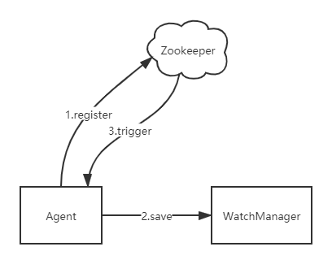

### Watcher接口的设计

在Zk中，Watcher本身既表示一个标准的事件处理接口，同时也是也是Server和Agent交互传递的对象。

> 观察Watcher的接口 ，可以发现其中定义了KeeperState和EventType两个枚举类，同时还定义了process()用于实现对事件的处理

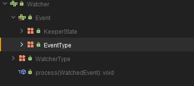

**WatcherEvent和WatchedEvent**

而上述的Event中有两个类似的类，分别是WatchedEvent和WatcherEvent。其实两者表示的是同一个事物，WatchedEvent用于逻辑上事件的处理，而WatcherEvent是实现了序列化接口用于网络传输的对象。

1. WatcherEvent

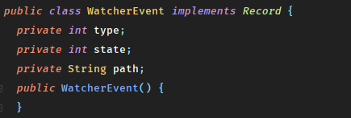

2. WatchedEvent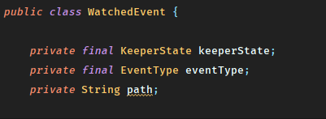

### 工作流程

#### 客户端

在客户端使用getData后，客户端首先会将请求进行标记，并将Watcher放入WatchRegistration中保存

> 观察Zookeeper.WatchRegistration
>
> 可以发现Watcher最终注册到了内存中

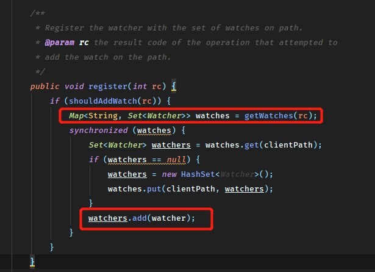

**那么给服务端传递的数据又具体是什么？**

其实每次客户端进行操作时并不会把真正的Watcher序列化并传递给服务器，因为如果序列化真正的对象那么通信效率和网络压力都是巨大的（毕竟Agent的每次操作都会携带Watcher）。基于性能考虑Agent传递的数据是相当轻量化的，而Watcher一次性使用的特点也印证了这点。

> 观察ClientCnxn中可以发现，仅传递了requestHeader和request

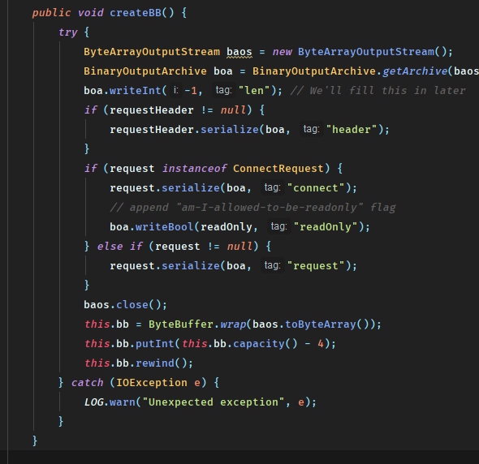

#### 服务端

在接收到客户端请求后，最终将在FinalRequestProcessor中进行处理，值得注意的是无论哪种事件处理都会将服务端对应控制当前连接的ServerCnxn对象作为参数传入。

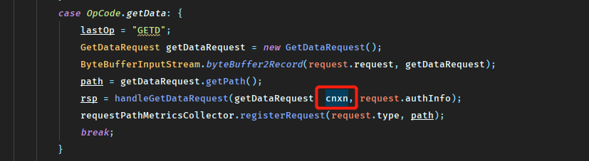

> 同时注意如下代码

1. getData()定义，第三个参数是Watcher

   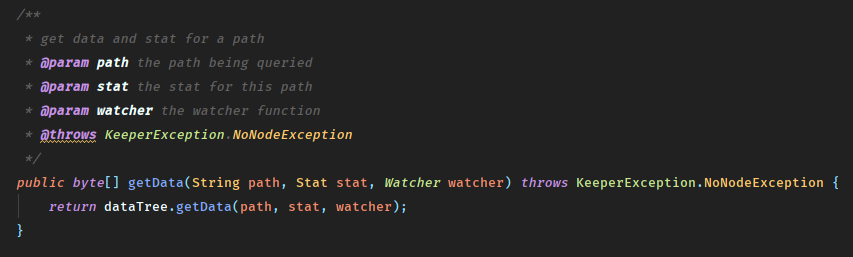

2. 如果客户端设置了Watcher那么传递ServerCnxn否则null

   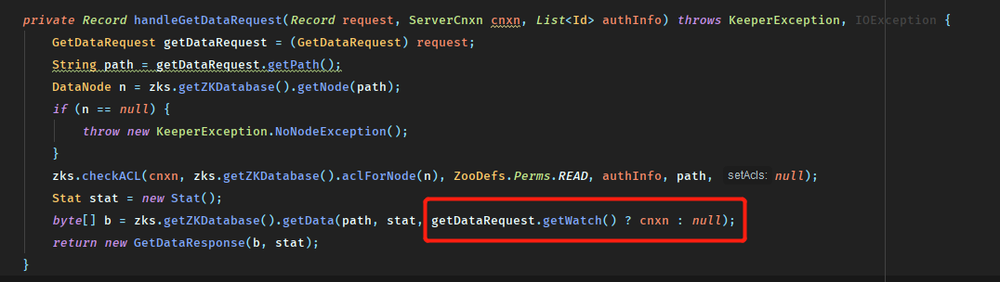

可以看到在服务端这边的处理，连接对象ServerCnxn行使了作为Watcher的功能，也印证了前面说的客户端并没有真正传递Watcher对象。

而继续跟踪代码则会发现服务端的Watcher最终保存到了WatchManager中，同样是通过HashMap保存到内存中。

最后触发是通过WatchManager进行触发，调用ServerCnxn的process()进行处理。

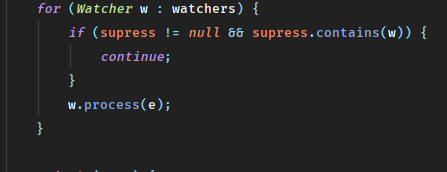

#### 关于ServerCnxn

ServerCnxn和ClientCnxn分别是服务端和客户端用于控制连接的对象，但服务端的ServerCnxn略有不同。实现了Watcher和Stats接口，这意味着既是连接对象也是服务端真正处理的Watcher。

> 观察实现类NettyServerCnxn

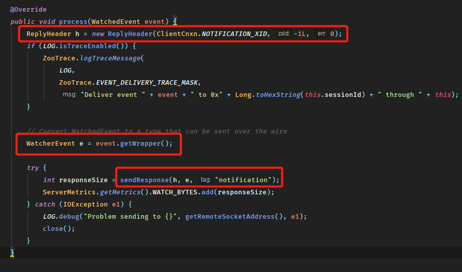

印证了之前说到的：

1. WatchedEvent将在用于网络传输时被转换成WatcherEvent
2. 服务端的Watcher处理仅将事件类型进行了简单通知

#### 客户端接收回调

最后消息被传递到客户端进行处理，大体分为如下步骤：

1. 反序列化
2. 处理chrootPath
3. 还原WatchedEvent
4. 回调Watcher

具体在ClientCnxn中定义了处理回调的线程逻辑：

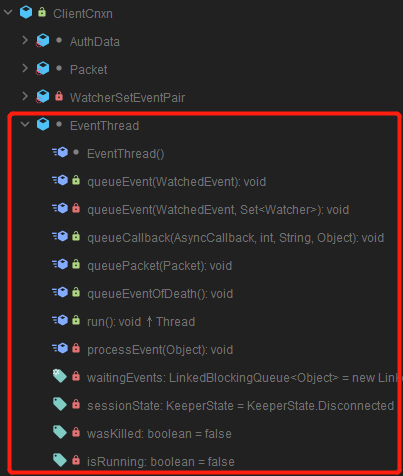

具体的处理逻辑根据不同的Watcher而变化