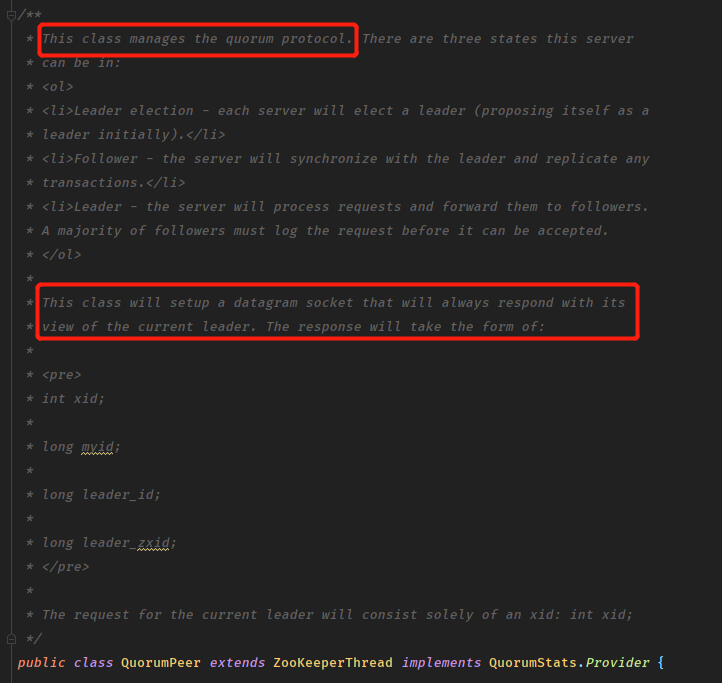
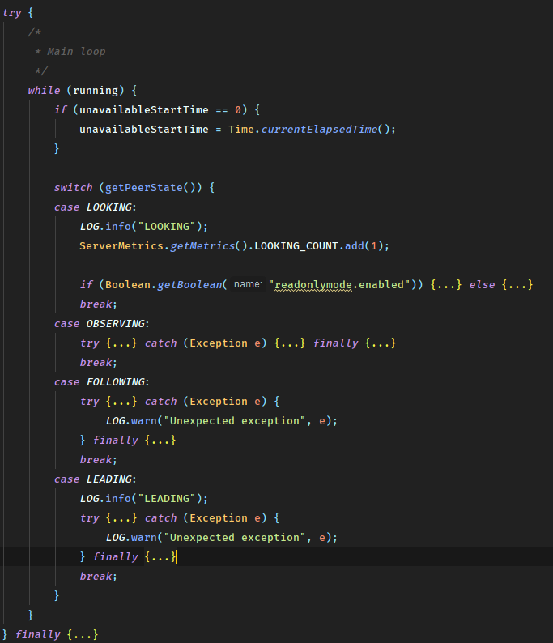
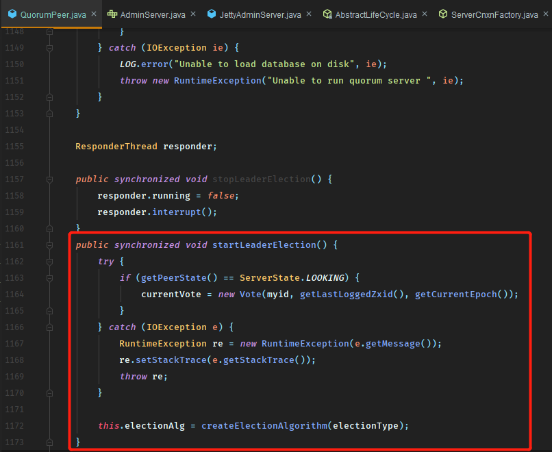
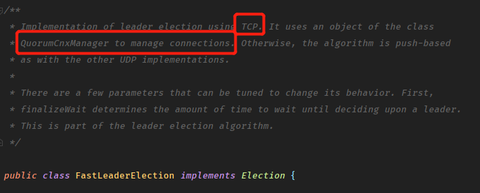
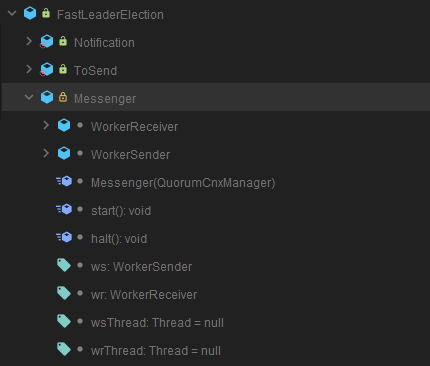
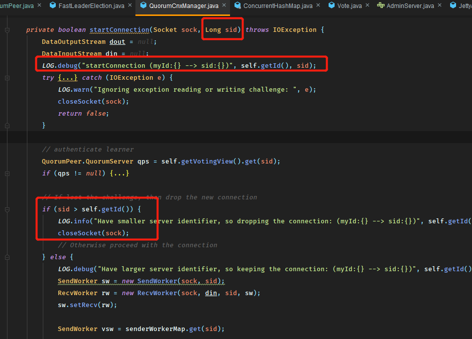
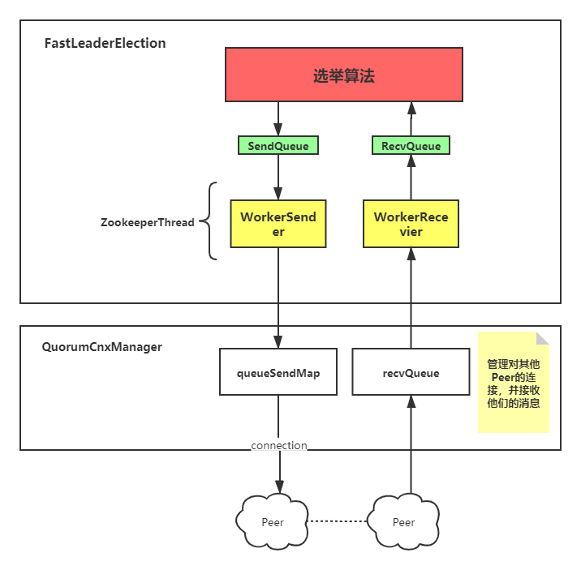

## Zookeeper-ZAB协议与Leader选举

### 为什么需要分布式一致性协议

在讨论ZAB协议即Zookeeper原子消息广播协议前，先讨论一下分布式一致性协议的意义所在。

首先，**任何的一致性协议本身都是为了解决信息同步的问题**，而这个问题不与实际的任何业务逻辑相关，ZAB协议也一样，协议本身并不决定功能，但每个分布式工具都需要一套协议来解决故障时的信息同步以确保系统正常工作以及恢复

### ZAB协议

#### 协议概述

ZAB协议是一种典型的**单主协议**，即同一时间集群中只会有一个主进程进行服务器状态变更的广播，同时在处理并发请求时会存在先后依赖关系，协议同样需要确保全局请求处理的顺序性（绝对的时间顺序）。

#### 协议介绍

协议的运行过程中包含两种模式以及两种角色，分别是**崩溃恢复**， **消息广播**和**Leader**，**Follower**

##### 消息广播

ZAB协议的消息广播过程类似二阶段提交，

>  Leader对客户端请求生成事务**Proposal**，并发送给集群中其他机器，分别收集选票最后进行事务提交

这种方式移除了二阶段的中断逻辑，也就是接收到Follower服务器超过半数ACK之后就进行了提交并广播Follower进行提交，而这样可能导致Leader服务器崩溃后集群内数据不一致：

例如Leader刚刚提交了Proposal之后崩溃了，其他Follower并未收到Commit最后丢弃了这个Proposal，导致恢复后的原Leader存在其他机器不存在的提交日志。同时从这里也可以看出Follower当Proposal出现问题时会进行抛弃，只会写入正确的日志，也就是只要Leader正常工作那么Follower一定写入了该日志，只有Leader会出现多余的日志而Follower只会出现缺少日志需要同步的情况。

##### 崩溃恢复

Leader在进行事务处理时会给每个事务分配一个ZXID

> ZXID是一个64位的数字，低32位自增表示某一个epoch中的事务顺序，高32位用于区分不同的epoch

根据这个ZXID，ZAB协议选择了一种快速且高效的Leader选举方式，拥有最高ZXID的机器成为Leader这样即保证了之前已经提交的全部事务的安全，同时其他机器只需要向前同步即可。

而且因为epoch的存在，恢复的Leader不可能立即再次成为Leader，因为其epoch将落后ZXID不可能为最高。

##### 发现、同步、广播

细分上述两个模式，可以划分成**发现，同步，广播**三个阶段，整个ZK按ZAB协议就在这三个阶段中转换。

1. 发现：

   - Follower给准Leader发送自己已提交最后的Proposal
   - 准Leader接收到过半CEPOCH后，就将epoch+1并广播给Follower
   - Follower接收到广播后反馈ACK给Leader

2. 同步：

   - Leader发送NEWLEADER给Follower确定领导地位
   - Leader按最大的事务广播给Follower进行同步（将Proposal和Commit一起先后广播，直接提交，这里我认为是考虑到**发现**过程中，已经有超过半数的集群参与了Leader选举，超过半数保证集群可用这件事已经被确认了，所以不像正常事务提交那样再进行一次二阶段提交并半数确认）
   - Follower按Proposal和Commit进行提交操作

3. 广播

   本质就是之前叙述的二阶段提交的过程

所以按这三个阶段，Zookeeper集群中的机器都处于如下三种状态之一：

1. **LOOKING**
2. **FOLLOWING**
3. **LEADING**

### Leader选举的源码实现

Leader选举的过程实际就是ZAB协议中**崩溃恢复**的对应实现，没有比直接浏览源码更能直接体会协议设计以及如何运行的方法了。

#### 前情梳理

浏览源码前首先需要对Leader选举的过程有个抽象认知，大致梳理我们可以得到这样一些问题：

1. 什么时候需要进行Leader选举？

   答：服务器启动加入集群时；机器与当前的Leader失去联系时

2. 选举算法是什么样的？

   答：广播自己选票，统计归票，投票变更，半数检查，更改服务器状态

3. 服务器间选举时的网络IO实现？

   答：与**消息广播**阶段时的连接对象`ServerCnxn`和`ClientCnxn`不同（这两种底层均是Netty提供支持使用NIO实现），**崩溃恢复**阶段的IO并不是NIO实现，而是Socket实现。

4. 选举的代码运行过程？选票的数据类型，消息管理，选票管理？

#### 源码分析

##### 进入Leader选举

首先找到`QuorumPeer`这个类，根据其描述，可以发现：

> 该类是维护本机器和其他集群机器之间连接的线程实现，同时也是**过半协议**的实现

可以认为该类维护且持续监测集群状态，下面代码中的主循环也证明了这点：

继续找到开始Leader选举的调用方法`startLeaderElection`，同时发现该方法的调用仅在服务器开启和当前为`LOOKING`状态时会进行选举。

同时观察这个方法可以发现，开始进行投票时，以myid，LastZXID以及epoch作为参数初始化了投票信息，这三个参数分别表示：

1. myid：服务器ID，服务器的唯一标识
2. LastZXID：ZXID为ZK中事务的ID，这里表示本机处理提交的最后一个事务ID
3. epoch：区分leader代数的值，这里用于相互投票时的验证功能

##### 选票发送与接收

选票的发送与收集都聚焦的`FastLeaderElection`这个类中，关于选举算法ZK曾经提供了多种实现，但是现在都以`FastLeaderElection`为准。可以看到描述中表明了选举过程的通信是基于TCP的，这里使用的是Socket的实现方式，同时`QuorumCxnManager`提供了对其他`Peer`的连接支持。

同时对结构分析：

- ToSend定义了向他人传递消息的结构类型
- Notification用于接收其他Peer的消息类型
- Messenger中维护了两个队列，以及实现了Sender和Recevier两个线程，分别用于发送消息的缓存以及接收消息

`Messenger`中的队列均为`LinkedBlockingQueue`实现，同时依赖了`QuorumCnxManager`进行Socket通信，所以消息的发送和接收均会通过**内存中的队列进行缓存**，同时两个工作线程会不断从队列中取出进行处理，并依赖**Socket**进行服务器间通信。

> 而我们知道TCP是全双工的协议，也就是两个服务器仅需要一个连接就可以进行双向通信，这里使用了一种取巧的实现方式

对于任意一个`Peer`而言，它会对其他服务器尝试进行SSL连接，并将自身的服务器ID和对方的ID进行比较，较小的一方将会放弃自己创建的连接，这样集群中两两之间可以确保仅有一个TCP连接用于通信

一个图来表示他们之间的关系：

##### 选举算法实现

---To be continue