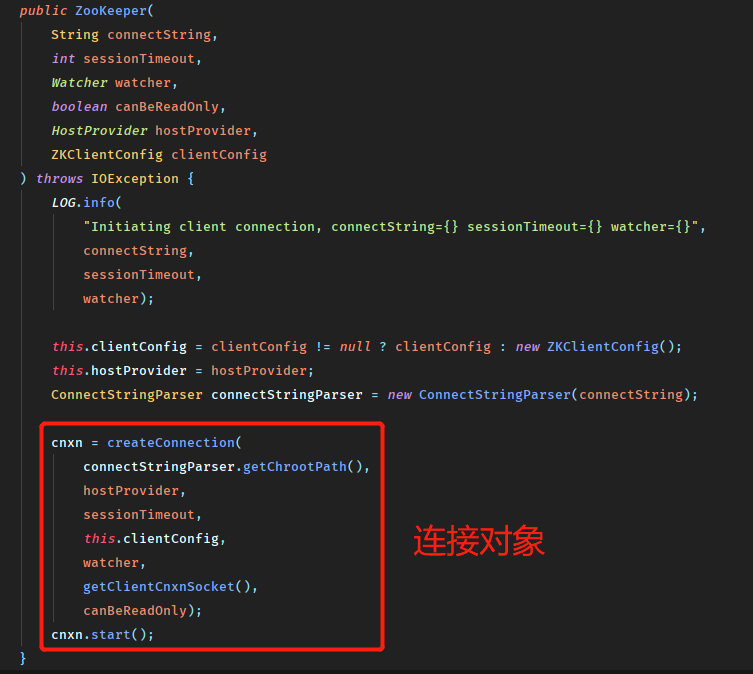
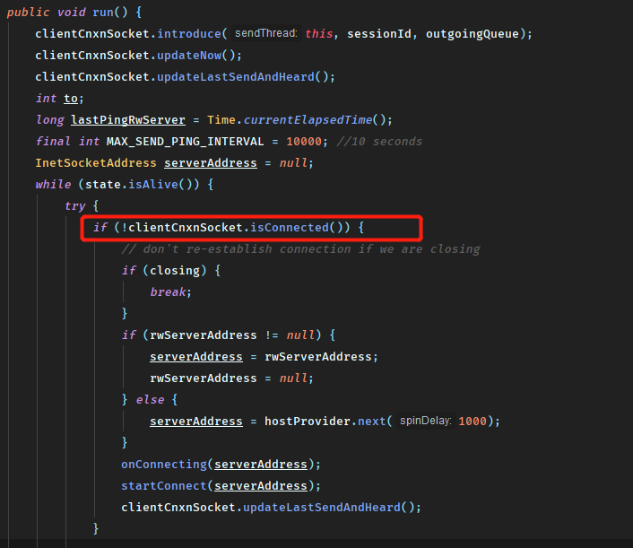

## Zookeeper的会话机制

会话是服务端和客户端连接通信的手段，没有会话的支持所有的功能命令也就无从谈起。

下面从**会话的创建流程**，以及**会话中的相关机制**两个方面进行梳理

### 会话的创建过程

分为**初始化阶段**， **会话创建阶段**和**响应处理阶段**

#### 初始化阶段（创建对象）

1. 初始化Zookeeper对象，同时会创建一个`ClientWatcheManager`实现类，位于连接对象中：

2. 设置会话默认的`Watcher`如果构造方法中传入了watcher对象，那么会将他作为默认的Watcher保存在`ClientWatchManger`中。（与上面的就是另外的初始化方法了）
3. 构造Zookeeper服务器地址列表管理器`HostProvider`
4. 创建并初始化客户端网络连接器`ClientCnxn`，其中包括了两个核心队列`outgoingQueue`和`pendingQueue`均是`BlockingQueue`实现。
5. 初始化`SendThread`和`EventThread`，前者用于管理客户端和服务端的所有IO请求后者对服务端回调的事件进行处理。同时对于`SendThread`还会将`ClientCnxnSocket`对象分配给它用于通信

#### 会话创建阶段

1. 启动`SendThread`和`EventThread`
2. 获取一个服务器地址，这里通常是从`HostProvider`中随机获取一个地址委托给`ClientCnxnSocket`进行下面的连接。
3. 创建TCP连接
4. 构造ConnectRequest请求
5. 发送请求

#### 响应处理阶段

1. 接收服务器的响应
2. 处理Response
3. 连接成功，需要进一步对客户端进行会话参数的设置，包括readTimeout和connectTimeout等，并通知`HostProvider`成功连接的服务器地址
4. 生成事件`SyncConnected-None`，这个事件是用于通知上层应用已经连接到服务器
5. 查询Watcher，处理事件

#### 一些细节

因为Zookeeper没有使用代理，所以客户端都是连接到其中一台服务器中进行请求。

那么自然会有以下几个问题

1. 如果连接到一个服务器的多个客户端使用了同样的节点名称怎么办？

   这点zk在3.2.0之后支持了一种`Chroot`特性，允许每个用户设置一个命名空间作为客户端操作节点的根节点，通过`connectString`中设置`Chroot`为/apps/x，那么在创建节点/test时，真正创建的节点是/apps/x/test。

   注意：这个特性在客户端中被封装得透明化了，这个值在创建后被保存在`ConnectStringParser`中，然后用于初始化`ClientCnxn`对象，下面是`ClientCnxn`对象中如何使用`Chroot`的一小段代码

2. 客户端初始化时传入了连接字符串中包含多个服务器地址，具体运行时将如何决定连接哪一台呢？

   这里同样是先传入到了`ConnectStringParser`中然后保存到了`StaticHostProvider`的列表中，并使用shuffle随机打乱组成循环链表，当客户端断开连接时将从其中取出一个进行连接。也比较容易开出来，连接失败时会顺序取出下一个进行连接。

当然这里显然还会产生一个疑问，ZK不是单主集群么，那么连接到了`Follower`怎么进行写请求呢？这个问题的话，Zk里面的`Follower`会将不能处理的写请求进行转发，具体的机制之后再聊。

#### 客户端连接对象ClientCnxn

-- To be continue