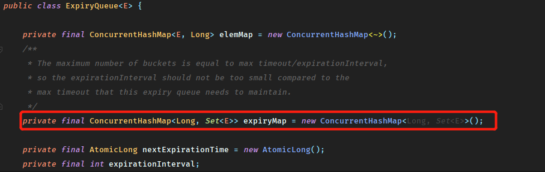

## Zookeeper的会话机制

会话是服务端和客户端连接通信的手段，没有会话的支持所有的功能命令也就无从谈起。

下面从**会话的创建流程**，以及**会话中的相关机制**两个方面进行梳理

### 会话的创建过程

分为**初始化阶段**， **会话创建阶段**和**响应处理阶段**

#### 初始化阶段（创建对象）

1. 初始化Zookeeper对象，同时会创建一个`ClientWatcheManager`实现类，位于连接对象中：

2. 设置会话默认的`Watcher`如果构造方法中传入了watcher对象，那么会将他作为默认的Watcher保存在`ClientWatchManger`中。（与上面的就是另外的初始化方法了）
3. 构造Zookeeper服务器地址列表管理器`HostProvider`
4. 创建并初始化客户端网络连接器`ClientCnxn`，其中包括了两个核心队列`outgoingQueue`和`pendingQueue`均是`BlockingQueue`实现。
5. 初始化`SendThread`和`EventThread`，前者用于管理客户端和服务端的所有IO请求后者对服务端回调的事件进行处理。同时对于`SendThread`还会将`ClientCnxnSocket`对象分配给它用于通信

#### 会话创建阶段

1. 启动`SendThread`和`EventThread`
2. 获取一个服务器地址，这里通常是从`HostProvider`中随机获取一个地址委托给`ClientCnxnSocket`进行下面的连接。
3. 创建TCP连接
4. 构造ConnectRequest请求
5. 发送请求

#### 响应处理阶段

1. 接收服务器的响应
2. 处理Response
3. 连接成功，需要进一步对客户端进行会话参数的设置，包括readTimeout和connectTimeout等，并通知`HostProvider`成功连接的服务器地址
4. 生成事件`SyncConnected-None`，这个事件是用于通知上层应用已经连接到服务器
5. 查询Watcher，处理事件

#### 一些细节

因为Zookeeper没有使用代理，所以客户端都是连接到其中一台服务器中进行请求。

那么自然会有以下几个问题

1. 如果连接到一个服务器的多个客户端使用了同样的节点名称怎么办？

   这点zk在3.2.0之后支持了一种`Chroot`特性，允许每个用户设置一个命名空间作为客户端操作节点的根节点，通过`connectString`中设置`Chroot`为/apps/x，那么在创建节点/test时，真正创建的节点是/apps/x/test。

   注意：这个特性在客户端中被封装得透明化了，这个值在创建后被保存在`ConnectStringParser`中，然后用于初始化`ClientCnxn`对象，下面是`ClientCnxn`对象中如何使用`Chroot`的一小段代码

2. 客户端初始化时传入了连接字符串中包含多个服务器地址，具体运行时将如何决定连接哪一台呢？

   这里同样是先传入到了`ConnectStringParser`中然后保存到了`StaticHostProvider`的列表中，并使用shuffle随机打乱组成循环链表，当客户端断开连接时将从其中取出一个进行连接。也比较容易开出来，连接失败时会顺序取出下一个进行连接。

当然这里显然还会产生一个疑问，ZK不是单主集群么，那么连接到了`Follower`怎么进行写请求呢？这个问题的话，Zk里面的`Follower`会将不能处理的写请求进行转发，具体的机制之后再聊。

#### 客户端连接对象ClientCnxn

在Watcher机制和ZAB协议与Leader选举中，都大量提到了这个对象。其实不用特别强调也能知道这个对象维护了客户端和服务器的网络连接。

其中包含了：

- Packet 内部定义的协议层封装类，作为请求和响应的载体
- ClientCnxnSocket 底层的Socket通信层
- SendThread 内部核心的IO调度线程，管理网络IO操作
- EventThread 处理客户端事件，从队列中取出待处理事件处理

### 会话创建的服务器视角

服务端的Session对象包含如下关键字段：

1. sessionID: 全局唯一的会话id
2. TimeOut：会话超时时间，客户端创建连接时会提供一个sessionTimeOut配置超时时间，服务端再根据自己的设置决定最终会话的超时时间
3. TickTime: 下次会话超时时间，这个涉及到会话管理的分桶策略
4. isClosing: 标记会话是否关闭

那么对于上面的字段很容易产生一个问题

> 客户端和服务端是点对点连接的，但集群内生成的sessionID如何保存集群内唯一？

可以看到如下SessionTracker中的代码

先以时间戳作为操作的基础，左移24位再右移8位，相当于空出了前面8位及后面16位。同时及机器sid最为前面的8位填充。

SID+时间戳，而SID可以确保不同服务器的sessionID不同（因为集群配置时sid不可能相同），而后面以时间戳作为基数可以确保同一机器生成的sessionID各自不同。

同时上面使用的是无符号右移，是因为单纯以时间做id基数时在2022年4月8日时会得到一个负数，所以使用无符号右移取代了右移。

> SessionTracker是什么？

`SessionTracker`是Zookeeper服务端的会话管理器，负责会话的创建，管理和清理工作。其中有三个对象以不同的维度保存了会话

- sessionsById 一个hashMap，sessionId对应会话
- sessionWithTimeout 一个ConcurrentHashMap，键对应sessionId，值为其超时时间
- sessionSets 一个HashMap根据下次的会话超时时间归档会话，值为sessionSet

关于`sessionSets`，最新的zk源码中已经替换成了一个队列的实现，如下图：

但其内部仍然是一个`ConcurrentHashMap`在维护（expireTime->session）的map

#### 会话管理的分桶策略

ZK中的会话管理并不是简单的计算完会话超时时间后就不断轮询检查会话超时，那样性能显然太差，也容易产生因为会话集中到一段时间过期而导致的阻塞问题。

这里使用了一种分桶策略，大致是如下的过程：

1. 对于每个会话会根据`currentTime`+`SessionTimeout`计算出一个实际的超时时间
2. 然后根据`ExpirationTime` = `(ExpirationTime/ExpirationInterval + 1) * ExpirationInterval`计算得到会话所属的区间。这一步实际上是将会话按预设的检查间隔分到对应间隔的桶中。
3. 上述的`expiryMap`中的key就是计算得到以`ExpirationInterval`为步长的时间戳，每隔这个间隔时间就会通过`ExpiryQueue.poll()`尝试取出一个`Set<Session>`进行检查。
4. 定时的心跳以及来自会话的操作都会激活该会话，激活会话时会产生会话迁移，也就是将会话迁移到后面的桶

那么这样分桶操作的好处是显而易见的

- 对所有会话的检查工作平摊到了不同的桶中，不需要同一时间检查全部会话
- 检查会话时的会话迁移可以看作是对会话的清理，因为剩下无法迁移的会话就需要清理，连续检查带来的频繁清理的工作变成了一段时间进行的一次批量清理

