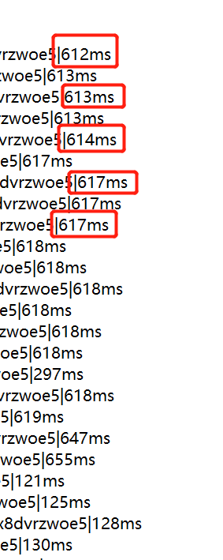
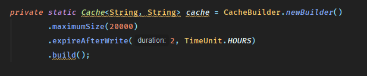

## 慢定时任务的优化重构

### 前情提要

因为项目历史原因，存在相当多使用SpringCron设计的定时任务用于各种数据同步，其中相当多的任务耗时时间长占用资源多，给机器和项目成本带来了很大负担。（胡扯ing）

那么今天要分享记录的是如何将原来单线程耗时一个小时的定时任务通过**多线程+缓存技术**优化到5分钟之内。

### 代码分析

优化之前必然要先找到代码执行慢的原因。

```java
public void work(){
    	Map<String,Department> orgMap = departmentService.selectFullNameMap();
		logger.info("update user job started ");
		String response = HttpClientUtils.httpGet(url);
    	if(!StringUtils.isBlank(response)&&response.contains("A00000")){
    		JSONObject object = JSON.parseObject(response);
    		JSONObject object2 = JSON.parseObject(object.get("data")+"");
    		JSONArray array = JSON.parseArray(object2.get("users")+"");
    		Iterator<Object> it = array.iterator();
    		List<Long> puidsnot = new ArrayList<Long>();
			Map<String,List<ExchangeUser>> nameUserMap = getExchangeUserNameMap();
    		int i = 0;
    		while(it.hasNext()){
    			..//省略处理过程
    		}
    		..//省略后续处理
    	}
		logger.info("update user job finished ");
    }
```


分析后这个用户同步任务的执行过程大致如下：

1. 从**URL**获取全部用户信息
2. 获取用户部门关系信息
3. 获取用户校对表
4. 单个用户的处理
   1. 从校对表校正用户邮箱
   2. 从部门表获取用户部门信息
   3. 从接口获取用户的leader链
   4. 收集非法用户到集合
5. 对非法用户的处理以及其他后续处理

其中4.2这一步中产生了大量的Http请求，对性能影响最大。可以想象这个过程：每个用户获取leader时都需要一级一级向上递归查询，一个用户产生了数个http请求，而且用户的Leader链显然是会最终收敛到CEO，用户一般查询一次之后的leader查询会有大量的重复不必要的查询。



可以看到http请求相当消耗时间

### 缓存优化

那么在上述分析情况下，假设共有10000个用户，平均一个用户查询5次leader，那么仅这个接口的调用就产生了50000次http请求。

在这种情况下，考虑使用缓存保存leader链信息。于是考虑使用**HashMap**存储用户信息，最后使用了guava的内存缓存。以name-leader作为k-v映射，最终的http请求除了全部用户必要的一次请求外没有任何多余请求



且在这种基础上测试，即是是单线程执行速度也优化到了20min左右

### 多线程改造

再次观察上述的执行过程，可以进行多线程优化的是**4.单个用户的处理**，这段代码的数据源是全量接口返回的iterator，而单个用户的处理依赖了一些对象，为了线程安全的保证分析了对对象的读写需求

- 用户校对表，仅用于查询用户邮箱-----仅读
- 部门用户表，查询用户部门，同时有新部门时需要写入-----读写
- leader链的缓存（guava），-----读写
- 非法用户表，将非法用户添加到其中，-----写入
- counter，处理用户计数器-----写入

所以将单个用户处理抽象成**Runnable**实现时传入了上述需求的对象。同时将上述对象进行了线程安全改造。

```java
private class Task implements Runnable{

    	private Iterator<Object> it;
    	private ReentrantLock lock;
    	private CopyOnWriteArrayList<Long> puidsnot;
    	private Map<String, List<ExchangeUser>> nameUserMap;
    	private Map<String, Department> orgMap;
    	private AtomicInteger counter;

    	Task(Iterator<Object> it, ReentrantLock lock, CopyOnWriteArrayList<Long> puidsnot, Map<String,List<ExchangeUser>> nameUserMap, Map<String, Department> orgMap, AtomicInteger counter){
			this.it = it;
			this.lock = lock;
			this.puidsnot = puidsnot;
			this.nameUserMap = nameUserMap;
			this.orgMap = orgMap;
			this.counter = counter;
		}

		@Override
		public void run() {
			while (true){
				JSONObject object = safeGet();
				if(null == object) break;

				updateSingleUserFromJson(object, puidsnot, nameUserMap, orgMap, counter);

			}
		}

		private JSONObject safeGet(){
    		try{
    			lock.lock();
				//iterator不是线程安全的
    			return it.hasNext() ? (JSONObject) it.next() : null;

			}catch (Exception e){
    			e.printStackTrace();
			}finally {
    			lock.unlock();
			}
			return null;
		}
		
	}
```

上述是改造后的Task对象，有写入需求的对象分别使用的**JUC**包中的并发集合类进行了替换：

使用**JUC**中的工具改造是因为JUC的实现都是基于乐观锁的CAS实现，性能更好

- HashMap-->ConcurrentHashMap
- ArrayList-->CopyOnWriteArrayList
- Integer-->AtomicInteger

而没有写入需求的对象不会产生安全问题，没有改造。

对于guava缓存，也有写入的需求，对源码进行了简单的浏览：


可以发现LocalCache的实现也是基于JUC的线程安全。

但是**iterator**的实现不是线程安全的，所以在任务提交线程传递一个锁进去，并对从**iterator**获取用户进行处理的过程加锁：


### 改造结果

那么最终改造后：

```java
public void work(){
		long start = System.currentTimeMillis();

		ThreadPoolExecutor executor = new ThreadPoolExecutor(20, 50, 10, TimeUnit.SECONDS, new LinkedBlockingDeque<Runnable>());

		Map<String,Department> orgMap = departmentService.selectFullNameMap();
		orgMap = new ConcurrentHashMap<String, Department>(orgMap);

		logger.info("update user job started ");
		String response = HttpClientUtils.httpGet(url);
    	if(!StringUtils.isBlank(response)&&response.contains("A00000")){
    		JSONArray array = JSON.parseArray(response);
            
    		Iterator<Object> it = array.iterator();
			CopyOnWriteArrayList<Long> puidsnot = new CopyOnWriteArrayList<Long>();
			Map<String,List<ExchangeUser>> nameUserMap = getExchangeUserNameMap();
			ReentrantLock lock = new ReentrantLock();
			AtomicInteger atomicInteger = new AtomicInteger(0);
			for(int i = 0; i < 25;i++){
				Task task = new Task(it, lock, puidsnot, nameUserMap, orgMap, atomicInteger);
				executor.execute(task);
			}
			//shutdown使线程不在接收新任务，terminate检查已开始任务的完成状态
			executor.shutdown();
			while(true){
				if(executor.isTerminated()){
					logger.debug("all task finished! start final process");
					break;
				}
			}
    		..//省略后续处理
    	}
		logger.info("update user job finished ");

		long end = System.currentTimeMillis();

		System.out.println("finish time: " + (end - start) / 60000);
	}
```

整理逻辑不变，但是单个任务处理由多个线程同时处理，并考虑到后续处理，利用循环等待线程池处理完全部任务。

在25个线程的同时工作以及缓存的优化下，最终同步任务仅耗时4min就执行完成：


