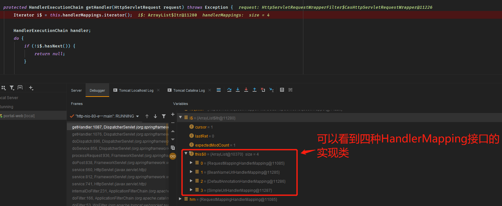
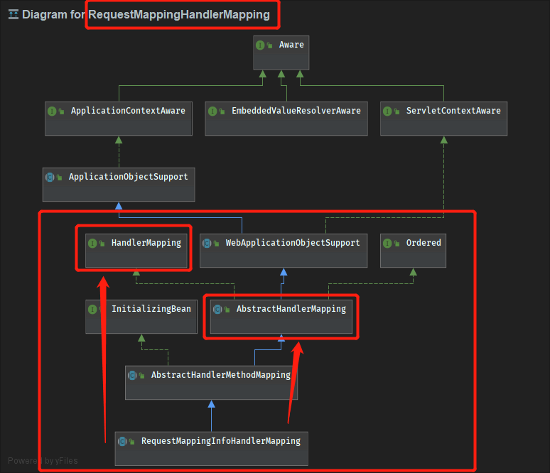
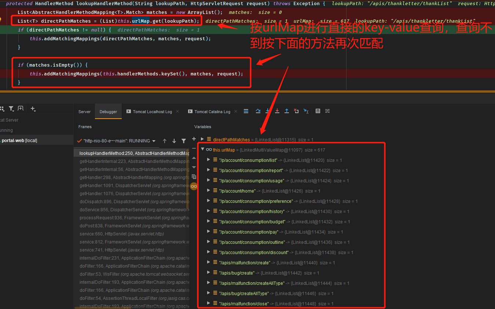
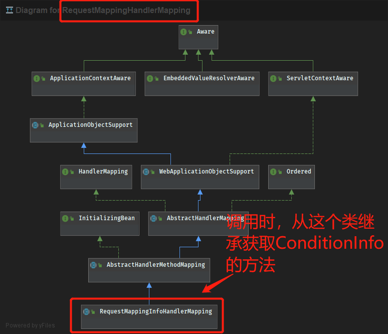

# 一次SpringMVC源码探险


## 问题的发现

因为项目陈旧的原因存在大量遗留代码，某次在处理一个业务项目的bug时发现，遗留的jsp页面中有一部分类似`xxx/get.action`这样的路由，但是在各个`controller`中又搜索不到。当时的判断可能是访问`xxx/get`和`xxx/get.action`是两个不同的方法所以导致了差异，**虽然最终调用两个路由都会进入`controller`的`/get`方法，但还是怀疑在进入之前对`.action`做了特殊的处理**。

在提到`.action`后，有知道的同事提醒可能是类似`strusts`的框架，但是一番搜索之后也没有看到仍会相关的依赖。所以只能考虑从`SpringMVC`的框架入手，从开始生成`HttpServletRequest`时开始跟踪，判断请求中的`uri`如何最终对应到了`/get`路由下。

## 排查路径

`DispathcerServlet.doDispatch`->`this.getHandler`->`AbstractHandlerMapping.getHandler`->`this.getHandlerInternal`->`AbstractHandlerMethodMapping.lookupHandlerMethod`->`RequestMappingInfo.getMatchingCondition`->`PatternsRequestCondition.getMatchingCondition`->`getMatchingPattern`

## 排查过程

下图是MVC中url从进入Spring框架到被业务定义的Controller处理前的全过程：


主要的逻辑是按：

1. `DispatcherServlet`
2. `HandlerMapping`
3. `HandlerAdapter`
4. `Handler`

顺序处理。


---

### DispatcherServlet

于是我们从`DispatcherServlet`的`doService`方法开始跟踪

```java
protected void doService(HttpServletRequest request, HttpServletResponse response) throws Exception {

        //省略掉前面不关心的代码
		//向下传递进行处理在doDispatch方法中
        try {
            this.doDispatch(request, response);
        } finally {
            if (WebAsyncUtils.getAsyncManager(request).isConcurrentHandlingStarted()) {
                return;
            }

            if (attributesSnapshot != null) {
                this.restoreAttributesAfterInclude(request, attributesSnapshot);
            }

        }

    }
```

进入到`doDispatch`中，可以看到一些关键内容，`Handler`的匹配，调用，以及`ModelAndView`的返回都在这块代码内

```java
protected void doDispatch(HttpServletRequest request, HttpServletResponse response) throws Exception {
        //获取request,handler的执行链
        HttpServletRequest processedRequest = request;
        HandlerExecutionChain mappedHandler = null;
        boolean multipartRequestParsed = false;
        WebAsyncManager asyncManager = WebAsyncUtils.getAsyncManager(request);

        try {
            try {
                //返回的modelAndView
                ModelAndView mv = null;
                Exception dispatchException = null;

                try {
                    processedRequest = this.checkMultipart(request);
                    multipartRequestParsed = processedRequest != request;
                    //这里将request传入去匹配得到handler执行链
                    mappedHandler = this.getHandler(processedRequest, false);
                    if (mappedHandler == null || mappedHandler.getHandler() == null) {
                        this.noHandlerFound(processedRequest, response);
                        return;
                    }

                    HandlerAdapter ha = this.getHandlerAdapter(mappedHandler.getHandler());
                    //省略掉后面通过ha调用得到mv的内容
    }
```

上面的`this.getHandler`将在`handlerMappings`中查找对应的调用链。

可以看到将在4种`mapping`中进行查找（关于`handlerMapping`的种类暂时未知）。



而查找方式是通过`HandlerMapping`接口实现类的`getHandler`方法，观察类继承情况以及方法实现情况：



### RequestMappingHandlerMapping

#### AbstractHandlerMapping

主要的`HandlerMapping`的实现类都继承了`AbstractHandlerMapping`这个抽象类，并使用其中的`getHandler`方法。并在getHandler中进入`AbstractHandlerMethodMapping`实现的`getHandlerInternal`方法。

在`getHandlerInternal`方法中已经几乎可以看到我们期望的内容了：

```java
protected HandlerMethod getHandlerInternal(HttpServletRequest request) throws Exception {
    	//这里解析出了request中包含的路径
        String lookupPath = this.getUrlPathHelper().getLookupPathForRequest(request);
        if (this.logger.isDebugEnabled()) {
            this.logger.debug("Looking up handler method for path " + lookupPath);
        }
		//并在这个方法中去查找对应的HandlerMethod
        HandlerMethod handlerMethod = this.lookupHandlerMethod(lookupPath, request);
        if (this.logger.isDebugEnabled()) {
            if (handlerMethod != null) {
                this.logger.debug("Returning handler method [" + handlerMethod + "]");
            } else {
                this.logger.debug("Did not find handler method for [" + lookupPath + "]");
            }
        }

        return handlerMethod != null ? handlerMethod.createWithResolvedBean() : null;
    }
```

然后仍然在这个类中，尝试匹配：

```java
protected HandlerMethod lookupHandlerMethod(String lookupPath, HttpServletRequest request) throws Exception {
        List<AbstractHandlerMethodMapping<T>.Match> matches = new ArrayList();
    	//在Mapping的urlMap中直接匹配
        List<T> directPathMatches = (List)this.urlMap.get(lookupPath);
        if (directPathMatches != null) {
            this.addMatchingMappings(directPathMatches, matches, request);
        }

        if (matches.isEmpty()) {
            this.addMatchingMappings(this.handlerMethods.keySet(), matches, request);
        }
    	//省略掉匹配之外的代码

            
    }
```



#### RequestMappingInfoHandlerMapping

而输入`get.cation`进入到`get`的关键就在下面的第二次匹配中

在通过`addMatchingMappings`方法后，将进入上图中`RequestMappingInfoHandlerMapping`类的实现方法中，并去获取一个`RequestMappingInfo`，

在看一次继承图：



#### RequestMappingInfo

并在`RequestMappingInfo`的这个方法中获取`Condition`

```java
 public RequestMappingInfo getMatchingCondition(HttpServletRequest request) {
        RequestMethodsRequestCondition methods = this.methodsCondition.getMatchingCondition(request);
        ParamsRequestCondition params = this.paramsCondition.getMatchingCondition(request);
        HeadersRequestCondition headers = this.headersCondition.getMatchingCondition(request);
        ConsumesRequestCondition consumes = this.consumesCondition.getMatchingCondition(request);
        ProducesRequestCondition produces = this.producesCondition.getMatchingCondition(request);
        if (methods != null && params != null && headers != null && consumes != null && produces != null) {
            //获取condition
            PatternsRequestCondition patterns = this.patternsCondition.getMatchingCondition(request);
            if (patterns == null) {
                return null;
            } else {
                RequestConditionHolder custom = this.customConditionHolder.getMatchingCondition(request);
                return custom == null ? null : new RequestMappingInfo(patterns, methods, params, headers, consumes, produces, custom.getCondition());
            }
        } else {
            return null;
        }
    }
```

#### PatternsRequestCondition

最后跟随`PatternRequestCondition`找到这样一个方法，`getMatchingPattern(String pattern, String lookupPath)`其中一段关键代码：

```java
if (this.useSuffixPatternMatch) {
                if (!this.fileExtensions.isEmpty() && lookupPath.indexOf(46) != -1) {
                    Iterator i$ = this.fileExtensions.iterator();

                    while(i$.hasNext()) {
                        String extension = (String)i$.next();
                        if (this.pathMatcher.match(pattern + extension, lookupPath)) {
                            return pattern + extension;
                        }
                    }
                } else {
                    boolean hasSuffix = pattern.indexOf(46) != -1;
                    if (!hasSuffix && this.pathMatcher.match(pattern + ".*", lookupPath)) {
                        return pattern + ".*";
                    }
                }
            }
```


可以得到MVC框架在匹配不到直接路径时，如果路径最后以`.`连接了一段路径，那么会被正则匹配到去点`.`之后的原始路径上。也就是最后访问`get.bction`和`get.abcdefg`都会匹配到`get`对应的`controller`中。

## 简单总结

一次url到达`Spring`时，会从`DispatcherSerlvet`的`doService`开始，到`doDispatch`，并：

1. 将在`HandlerMappings`直接按`urlMap`进行匹配
2. 匹配不到则进入`RequestMappingInfoHandlerMapping`中去尝试获取一个`Condition`
3. 而这个获取时会按一定的正则规则进行`url`的匹配，尝试找到一个`Handler`也就是Controller去处理请求