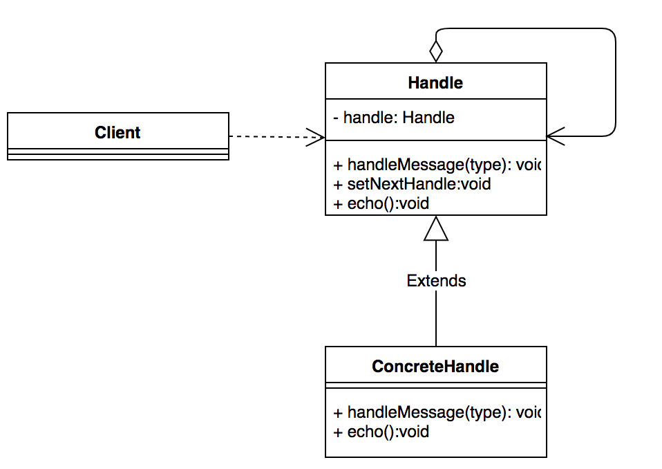

# 责任链模式实践

责任链模式相比单例模式这种而言，没有那么让人耳熟能详，但是作为**拆分复杂的判断逻辑**并且将**业务解耦**责任链可以说是无处不在。

### 模式定义

在这种模式中，每个对象定义一种处理逻辑，同时链中每个对象都有机会处理请求，这些对象将连成一条链，并沿着链向下传递请求，从而避免了请求的发送者和接收者之间的耦合关系。

简单来说：

1. 发送者和接收者解耦
2. 每个对象设计时仅处理自己的请求
3. 每个对象接收前一个对象传递来的上下文
4. 每个对象向后传递自己处理后或处理不了的上下文

责任链模式通用类图：



## 使用场景

最简单的例子：**给定一个输入值，根据输入值的不同执行不同逻辑**

```java
String input = "1";  
if ("1".equals(input)) {    
    //TODO do something  
} else if ("2".equals(input)) { 
    //TODO do something  
} else if ("3".equals(input)) {   
   //TODO do something       
}

//或者
switch (input) { 
  case "1":    
    //TODO do something    
    break;   
  case "2":     
  //TODO do something     
   break;   
  case "3":   
   //TODO do something    
   break;  
  default:    
   //TODO do something    
  break;  
 }
```

并不是说不应该这么写，或者不应该写`if-else`的判断。

而是考虑扩展性和业务需求，如果每个`if`或者`switch`的`case`里面业务比较复杂，代码较多，那这个文件非常容易就会突破千行（比如10个if，每个if里面100行的处理逻辑）。及时不使用设计模式，这种过大的文件也有拆分的必要性。

## 代码展示

这里贴一段[美团技术团队](https://tech.meituan.com/2020/03/19/design-pattern-practice-in-marketing.html)的样例代码：

```java
//定义一个抽象的规则
public abstract class BasicRule<CORE_ITEM, T extends RuleContext<CORE_ITEM>>{
    //有两个方法，evaluate用于判断是否经过规则执行，execute用于执行具体的规则内容。
    public abstract boolean evaluate(T context);
    public abstract void execute(T context) {
}
​
//定义所有的规则具体实现
//规则1：判断服务可用性
public class ServiceAvailableRule extends BasicRule<UserPortrait, UserPortraitRuleContext> {
    @Override
    public boolean evaluate(UserPortraitRuleContext context) {
        TakeawayUserPortraitBasicInfo basicInfo = context.getBasicInfo();
        if (basicInfo.isServiceFail()) {
              return false;
        }
        return true;
    }
  
    @Override
    public void execute(UserPortraitRuleContext context) {}
​
}
//规则2：判断当前用户属性是否符合当前资源位投放的用户属性要求
public class UserGroupRule extends BasicRule<UserPortrait, UserPortraitRuleContext> {
    @Override
    public boolean evaluate(UserPortraitRuleContext context) {}
  
    @Override
    public void execute(UserPortraitRuleContext context) {
        UserPortrait userPortraitPO = context.getData();
        if(userPortraitPO.getUserGroup() == context.getBasicInfo().getUserGroup().code) {
          context.setValid(true);
        } else {
          context.setValid(false);
        }
    }
}
  
//规则3：判断当前用户是否在投放城市，具体逻辑省略
public class CityInfoRule extends BasicRule<UserPortrait, UserPortraitRuleContext> {}
//规则4：根据用户的活跃度进行资源过滤，具体逻辑省略
public class UserPortraitRule extends BasicRule<UserPortrait, UserPortraitRuleContext> {} 
​
//我们通过spring将这些规则串起来组成一个一个请求链
    <bean name="serviceAvailableRule" class="com.dianping.takeaway.ServiceAvailableRule"/>
    <bean name="userGroupValidRule" class="com.dianping.takeaway.UserGroupRule"/>
    <bean name="cityInfoValidRule" class="com.dianping.takeaway.CityInfoRule"/>
    <bean name="userPortraitRule" class="com.dianping.takeaway.UserPortraitRule"/>
      
    <util:list id="userPortraitRuleChain" value-type="com.dianping.takeaway.Rule">
        <ref bean="serviceAvailableRule"/>
        <ref bean="userGroupValidRule"/>
        <ref bean="cityInfoValidRule"/>
        <ref bean="userPortraitRule"/>
    </util:list>
      
//规则执行
public class DefaultRuleEngine{
    @Autowired
    List<BasicRule> userPortraitRuleChain;
​
    public void invokeAll(RuleContext ruleContext) {
        for(Rule rule : userPortraitRuleChain) {
            rule.evaluate(ruleContext)
        }
    }
}
```

总体来说：

1. 抽象一个`abstract`类当作模板类，定义其具体实现的方法。
   1. 判断是否当前节点执行
   2. 执行业务逻辑
2. 按业务需求实现节点
3. 定义一个`Manager`类或者直接注册节点，将节点串起来
4. 真正处理请求的地方调用这条链

## 业务实践

### 业务背景

用户从公司离职时需要转交全部的资源，而资源其实是分散在各处的，需要一一处理。最近这个页面总有人报错，打开代码一看就是上面所描述的一连串`if-else`串起来的业务代码。并且因为串联顺序的原因，所有的资源只能按顺序转交。所以有必要进行重构

#### 可自定义顺序

> 上面其实提到了责任链的另一个隐藏的优势，那就是因为不需要硬编码而带来的灵活性。

传统的`if-else`写死在代码中，希望生效新的方案则必须**修改代码**并**重启程序**才可以有效

而责任链因为链节点的定义是解耦的，顺序是配置的，除非需要增加新的需求，否则仅**修改配置中节点的顺序**并**重启程序**可以生效，而**重启程序**这个步骤可以通过将配置移到**配置中心**变为可以热修改的配置，那么连重启程序这一步也可以省略。

实现节点的处理顺序和代码完全解耦(不需要重新编码的情况下改变程序运行状态)

### 设计实现

首先定义一个处理资源转交的基类`LeaveHandler`

```java
public abstract class LeaveHandler {

    public static final String UID = "uid";
    public static final String USER_NAME = "userName";
    public static final String USER = "user";
    public static final String STEP = "step";
    public static final String STEPS = "steps";
    public static final String PAGE_TIP = "pageTip";

    String message;

    public abstract boolean needHandle(Map<String, Object> context);

    public abstract ModelAndView buildView(Map<String, Object> context) throws Cloud2Exception;

    public String getMessage() {
        return message;
    }

    public void setMessage(String message) {
        this.message = message;
    }

}
```

并实现按业务需求的具体实现类如下：

1. MachineHandler
2. ClientCertHandler
3. ...

接下来定义一个`Manager`类对节点进行管理组装成链，主要是如下三部分内容：

1. 常量，用于和**配置中心**的配置进行节点的映射
2. 对外提供一个传入配置构造链的入口
3. 一个获得链的方法

```java
public class LeaveHandlerChainManager {

    @Autowired
    ConfigCenterService configCenterService;
    @Autowired
    MachineHandler machineHandler;
    @Autowired
    ProjectHandler projectHandler;
    ...

    /**
     * 虚机
     */
    private static final String MACHINE = "machine";
    /**
     * 项目
     */
    private static final String PROJECT = "project";
  	...

    private List<LeaveHandler> defaultLeaveHandlerChain;

    @PostConstruct
    private void init() {
        String[] config = DEFAULT_CONFIG.split(";");
        defaultLeaveHandlerChain = buildChain(config);
    }

    public List<LeaveHandler> buildChain(String[] handlerConfig) {
        if (handlerConfig == null || handlerConfig.length == 0) {
            return Collections.emptyList();
        }
        List<LeaveHandler> res = new ArrayList<LeaveHandler>();
        for (String config : handlerConfig) {
            if (MACHINE.equals(config)) res.add(machineHandler);
            else if (PROJECT.equals(config)) res.add(projectHandler);
            ...
        }
        return res;
    }
    
    public List<LeaveHandler> getLeaveHandlerChain() {
        String[] currentConfig = configCenterService.getLeaveStepOrderConfig();
        if (currentConfig == null) {
            return defaultLeaveHandlerChain;
        }
        return buildChain(currentConfig);
    }

}
```

最后在`Controller`中进行调用：

```java
List<LeaveHandler> leaveHandlerChain = leaveHandlerChainManager.getLeaveHandlerChain();
		Map<String, Object> context = new HashMap<String, Object>();
		context.put(LeaveHandler.STEPS, getStepsFromChain(leaveHandlerChain));
		context.put(LeaveHandler.USER, user);
		context.put(LeaveHandler.UID, user.getUid());
		for (int i = 0; i < leaveHandlerChain.size(); i++) {
			LeaveHandler handler = leaveHandlerChain.get(i);
            //按节点定义的逻辑判断是否需要处理
			boolean need = handler.needHandle(context);
			if (need) {
				context.put(LeaveHandler.STEP, i + 1);
                //进行业务处理
				return handler.buildView(context);
			}
		}
```

## 总结

责任链模式在业务逻辑选择较多而且代码比较负载时可以使用，可以有效降低业务代码之间的耦合度，同时拆分文件便于后续扩展和测试。

但切记不可为了设计而设计，如果需求十分简单不超过10个的`if-else`且处理也比较简单就没有必要切分增加开发成本。

### 源码中的责任链

最近在学习`Netty`以及看部分`MVC`源码时有注意到相当多的责任链模式使用，有空再学习一波记录一下。